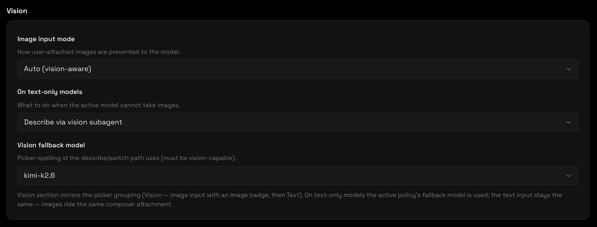

# Changelog

All notable changes to KiroCrew are documented in this file.

## [0.2.0-customapi.5] — 2026-08-08 — Vision

**Big feature: native vision — image models feel first-class, not bolted on.**

Every model now reports `supports_vision`; the picker groups **Vision — image input** (muted **Image** pill) above **Text**, and **Settings → Chat → Vision** governs how text-only models handle images (describe subagent / switch / off + fallback model). Attach any image via the composer's `+` / drag-drop — it rides as native pixels on vision models, or as a one-shot `vision_subagent_describe` on text-only ones (the `vision_analyze` MCP tool is also available to the agent). Images are downscaled to model limits before they ever reach the gateway.

### Added

- **`vision_analyze` MCP tool** — the main agent can describe any local path or http(s) image URL on demand (`vision_analyze({ path|url })`), so screenshots the agent itself captures enter the conversation as text.
- **Vision-aware image routing** — `prompt_blocks` downscales + `vision.decide_image_input_mode` routes `auto` → native vs text; `AcpClient` + shared-runtime `AcpSessionHandle` both honor it so Slack/cron/dashboard share one implementation. Two new config keys surface in `config.json` (`agent.image_input_mode: auto|native|text`, `agent.image_redirect: subagent|switch|off`) and the new Settings card.
- **Reported `supports_vision` flag** — every `GET /api/models` row carries it (registry `supports_vision` + router catalog `capabilities` + ACP `oc/ol deepseek-v4-flash` denylist), wired `AcpAdapter` → `ModelDropdownList` grouping.
- **Multi-provider picker — full catalogs** — `oc/` (opencode-go) and `ol/` (ollama) now expose their full catalogs (mimo-v2.5, glm, kimi, minimax, qwen, gemma, …), with 9router `ocg`/`ollama` normalization so `oc/mimo-v2.5`, `ol/glm-5.2` etc. are selectable end-to-end.
- **Settings → Chat → Vision** — native `Image input mode`, `On text-only models`, and `Vision fallback model` selects, right next to Default Model. The model picker's Vision grouping is derived from the reported flag, not a hard-coded client list.

### Fixed

- AppImage gateway startup blockers (packaged-build path) and shared-runtime image prompt parity.

## [0.2.0-customapi.4] — 2026-08-08

The kirocrew-customapi fork: Kiro Crew with the Claude Code ACP backend re-enabled for self-hosted LLM routers (9router, CLIProxyAPI, OpenCode Zen, Ollama Cloud, and any Anthropic/OpenAI-compatible endpoint).

### Fixed

- **Endless loading in chat (OpenCode backend)** — the OpenCode ACP process now runs in an isolated `HOME`, so user-installed plugins (Honcho) and MCP servers can no longer stall the session.
- **Ollama Cloud 405/Unauthorized** — Ollama Cloud's Anthropic endpoint rejects cloud API keys; the wire format is now forced to OpenAI (`/v1/chat/completions`) which accepts the same keys and models.
- **Provider preset reset to "custom"** — the preset now derives from the saved URL, so it stays selected after save + reload.
- **"connection failed: undefined" on Test** — the provider test now uses the stored API key when no draft key is entered.
- **Stale model from old provider** — switching provider clears the default model and model whitelist, so old ids (e.g. `deepseek-v4-flash:0731`, `oc/mimo`) no longer leak into the new provider's picker.
- **Router-prefixed models in kiro-native** — `cx/`, `oc/`, `ol/` prefixed models are cleared on provider switch and no longer appear in the kiro-native model list.

### Added

- **Provider binary warnings** — Settings > Chat now warns when the selected backend's binary (OpenCode CLI or claude-agent-acp) is not installed.
- **New provider presets** — Ollama Cloud (OpenAI wire), OpenCode Zen/Go, commandcode.ai, 9router, CLIProxyAPI, OmniRouter, Anthropic, OpenRouter, xAI, Mistral, DeepSeek, Together, OpenAI, Groq.

### Verified

- 767 Python tests + frontend tests pass.
- Live AppImage chat returns instantly.
- All 14 provider URLs verified (200 or auth-required).

## [0.2.0-customapi.1] — 2026-08-06

Initial kirocrew-customapi fork. Re-enabled the dormant `claude_code` provider (the `ACP_BACKEND_CLAUDE` seam) so Kiro Crew can drive your own model router speaking the Anthropic API instead of Kiro's built-in Bedrock catalog.

## [0.1.2] — 2026-07-30

First public release of KiroCrew — an open-source personal AI agent that runs on
your own machine, driving [kiro-cli](https://kiro.dev) over the Agent Client
Protocol. Install it, sign in once, and it is yours: no server to rent, no
account to create, and your conversations, memory, and files stay on your disk.

### Chat from wherever you already are

- **One agent, ten ways in** — A web dashboard, a native desktop app, a terminal
  CLI (`kirocrew chat`, plus a full TUI), and bots for **Slack, Discord,
  Telegram, Microsoft Teams, Webex, WeCom (企业微信), and WeChat** all drive the
  same gateway with the same memory and the same tools. Start
  something at your desk, follow up from your phone. Each Slack thread or
  Discord DM is its own isolated session, and a dashboard session can be handed
  off to a Slack thread and stay in sync both ways.
- **A dashboard built for long sessions** — Multiple concurrent chats with
  auto-generated titles, live streaming tool status, and a context-usage ring.
  Edit and resend an earlier message, rewind a conversation to any point, fork a
  session into a new tab with its full context, or regenerate a reply and browse
  the variants. Organize with project folders, tags, Trello-style columns, and
  per-session colors; search across every session by content. 18 color themes,
  a Monaco code editor, `@filename` fuzzy file attach, and an incognito mode
  whose sessions never write to memory.
- **Speak and be spoken to** — Live streaming speech-to-text over WebSocket,
  voice memos transcribed on arrival, and local Piper text-to-speech for replies
  with no cloud round-trip.
- **Ten languages** — The interface ships in English, German, Spanish, French,
  Italian, Portuguese, Russian, Hindi, Bengali, and Chinese.

### Work that continues while you are away

- **Unattended multi-step tasks** — Hand it a spec and it decomposes, executes,
  tests, and retries (`kirocrew run TASK.md`), designed for 10+ hour runs. It
  checkpoints to disk, so a crash or Ctrl+C resumes where it stopped; if
  kiro-cli dies it rebuilds the session and carries on; a watchdog catches
  stalls; and an LLM reviewer checks the result against the spec before calling
  it done. Failed steps become lessons it keeps.
- **Autopilot** — A per-session toggle that turns ordinary chat into
  plan-then-execute, with visible, editable plans, for when a request is bigger
  than one turn.
- **Cron scheduling** — Recurring jobs with per-job timezones, skip-dates for
  holidays, per-job timeouts, and jitter to spread load. Each job chooses
  whether it remembers the previous run. A job that finds a broken build at 3am
  can fix it and tell you over breakfast.
- **Parallel subagents** — Split one job across background agents
  (`kirocrew spawn run`), blocking or fire-and-forget, with progress visible in
  the chat header and completions delivered back into the conversation.
- **Dynamic workflows** — For work too structured for one agent, an authored
  Python script drives many agents through fan-out, pipelines, and
  judge-and-verify stages. An agent will usually write the script for you from a
  plain-English goal.
- **Proactive push** — The agent can pause mid-session to poll something, or
  register a webhook so an external system (CI, an alert, an inbox) wakes it up
  later.

### It remembers, and it learns

- **Memory that survives restarts** — Preferences, project context, and daily
  conversation history persist and are searched both by keyword and by meaning.
  Embeddings run **locally and in-process**, so nothing leaves your machine to
  make memory work. A graph explorer shows how memories relate.
- **Corrections stick** — Correct the agent once and it is kept as a lesson
  injected into every future session, so the same mistake does not return next
  week.
- **Knowledge Library** — Ingest your own documents and code into a searchable
  personal knowledge graph the agent can consult.
- **Snapshot and restore** — One command backs up config, memory, lessons,
  crons, skills, and history; restore all of it or just selected components,
  with a dry-run preview.

### Extend it

- **Apps, with six built in** — An App Store in the dashboard, an `app.json`
  manifest, TypeScript and Python SDKs, and gateway lifecycle hooks. Shipping in
  the box: **Auto Research** (multi-cycle research campaigns that keep going
  after you walk away), **Code Review Sage** (reviews each changed file of a PR
  in its own agent session), **Issue Radar** (GitHub/GitLab triage that
  remembers its notes), **Workflows**, **File Explorer**, and **Dev Fleet**.
- **Skills** — Plain markdown files that teach the agent a workflow, loaded
  automatically when a message matches or on demand when it decides it needs
  one. Twelve ship built in; write your own with no code and no rebuild.
- **Any MCP server** — Discover, probe, enable, and disable MCP servers from the
  dashboard. KiroCrew's own capabilities are exposed the same way, so the agent
  calls structured tools instead of shelling out.
- **Artifacts** — Documents, code files, and interactive widgets with a stable
  identity, version history, and a dashboard library. Deploy a webapp artifact
  to **your own** AWS account and get a public HTTPS link with a TTL.

### Drive your desktop, not just a browser tab

- **Computer use** — The agent can read a native application through the
  accessibility layer and operate it: take a window as a numbered outline of its
  buttons, fields, and rows, then press, type, set a value, scroll, or drag.
  This reaches work with no web UI — pulling a figure out of a spreadsheet,
  walking a desktop-only internal tool, reading an error dialog and telling you
  what it says. **Your mouse pointer never moves by accident**: actions are
  delivered to the target app, so a background window works without stealing
  your cursor or focus, and the one path that does take your real pointer has to
  be named explicitly by the model — the automatic choice never resolves onto it.
  **Off by default and macOS-only in this release**; enable it in Settings →
  Computer Use. Password fields are never read and a window holding one is never
  photographed, destructive-command-shaped text is refused rather than typed, and
  every call — allowed or refused — is written to the audit log.
- **Browser automation** — Playwright-driven navigation, form filling, and
  screenshots, including the ability to look at its own front-end changes and
  judge them.

### Security you can reason about

- **An OS sandbox you can switch on** — kiro-cli subprocesses can be confined by
  Linux namespaces or macOS Seatbelt, with three modes controlling which
  credential directories are even visible. This ships **opt-in**: the default
  (`agent.sandbox: "off"`) defers to whatever sandboxing kiro-cli applies itself,
  so set `agent.sandbox` to `"auto"` to have KiroCrew wrap the subprocess.
- **Layered controls** — 137 built-in denied-command patterns that hold even in
  YOLO mode, credential redaction scanning everything the model emits, blocked
  access to `~/.aws` and `~/.ssh`, XSS sanitization with CSP, and an audit log of
  every command.
- **A ceiling the agent cannot raise** — A two-level governance model
  (`POLICY ∩ PROFILE`, tightest-wins) enforced at KiroCrew's own tool gate. The
  policy files live where the agent can neither read nor write them, so a
  prompt-injected agent cannot widen its own limits. Tool calls are auto-approved
  by default (`agent.approval_mode: "auto"`) with the deny and governance gates
  still applied first — set it to `"interactive"` to be asked before each call.
  The dashboard is loopback-only and the Slack bot is locked to its owner.

### Run it your way

- **Install however suits you** — A signed and notarized universal macOS DMG, a
  Linux AppImage, a multi-arch Docker image for always-on servers, and a
  `pip`-installable wheel. The desktop app bundles its own Python, so end users
  need no toolchain. Runs on **macOS, Linux, and Windows**.
- **Three release channels** — **stable** is the default; **insider** gets
  release candidates a week or two early and is a switch away in Settings, since
  the two share one app and just follow different update lanes; **nightly**
  tracks the latest code and installs alongside your production app rather than
  replacing it, so you can run both. The desktop app updates itself, and nothing
  downloads or installs without you asking.
- **Always on** — Install as a systemd or launchd service, and manage several
  remote instances (dev boxes, EC2, a home server) from one hub over SSH.

### For app developers

- **`ctx.cron` mutators stay synchronous, with `*_async` siblings.** The App Kit
  surface (`add_job` / `remove_job` / `update_job` / `remove_all`) is
  synchronous, as published. Called from a genuinely loop-less context (CLI, MCP
  process, worker thread — what apps overwhelmingly use) they run inline as
  before. Called from a **running event loop** — an on-loop `on_startup` hook or
  route handler — they now raise `CronSyncOnLoopError` instead of parking the
  gateway loop for the cron-store lock window and stalling chat, timers, and
  heartbeats for every session. Migration is one line:
  `ctx.cron.add_job(...)` → `await ctx.cron.add_job_async(...)`, identical
  arguments and return value. The error is raised before any mutation, so a
  refused call never half-applies.

### Notes

- **kiro-cli is required** — KiroCrew orchestrates it. `kirocrew setup` walks you
  through installing and signing in; `kirocrew doctor` verifies the whole wiring.
- **Data lives in `~/.kiro/crew`** — override with `KIROCREW_HOME`. Installs
  using the earlier `~/.kirocrew` layout migrate automatically on first launch.
- **The dashboard defaults to `http://localhost:5476`** — override with
  `KIROCREW_PORT`.
- **Optional extras** — speech-to-text needs `pip install kirocrew[voice]`; the
  OS sandbox is POSIX-only; computer use is macOS-only in this release.
