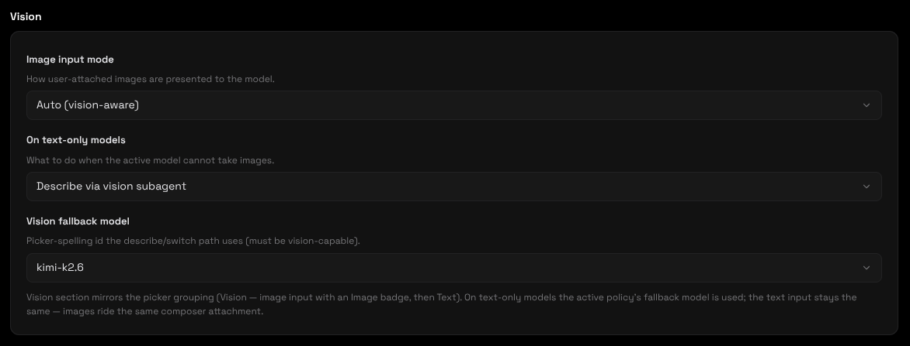

# Changelog

All notable changes to KiroCrew are documented in this file.

<<<<<<< HEAD
## [0.5.2-roycrew.1] — 2026-08-31

**The provider picker now applies a backend switch immediately, and Claude
Code native no longer borrows the router's credential.**

- Switching the provider in Settings → Chat only set a local draft awaiting
  Save, so nothing reached the config and the next render read the old value
  straight back. The endpoint's switch side effects — provider-factory reload,
  live-session eviction, per-slot model clear — never ran either, so even a
  later Save could leave an open chat answering on the previous backend. The
  choice is now written on click, and the config refetch is awaited before the
  draft is dropped (dropping it first re-rendered the stale cache, which reads
  as the change reverting).
- Switching also reset the draft to an empty base URL, so a subsequent Save
  wrote `""` over a working router. The URL now carries across the switch.
- Claude Code native (no base URL) was still being handed
  `agent.provider_api_key` as `ANTHROPIC_API_KEY`. That key is a ROUTER
  credential; sent to Anthropic it failed every turn with 401 "API key is
  invalid". The config key is now gated on there being a router to send it to.
  An ambient `ANTHROPIC_API_KEY` still reaches the backend as before.

## [0.5.1-roycrew.1] — 2026-08-30

**Router model ids now follow the router, not a built-in table.** Three
failures against a live 9router install, all from assuming every router
behaves like CLIProxyAPI (raw ids, prefixes rejected). 9router is the mirror
image: it publishes `cx/gpt-5.5` and answers the stripped spelling with
`model_not_found`.

- An id the connected router advertised is sent upstream verbatim. The catalog
  is probed when the spawn environment is built — where the decision is
  actually made — rather than at session init, which happens too late to
  choose the spelling. Routers that advertise nothing keep the previous
  behaviour, so CLIProxyAPI is unaffected.
- `auto` resolves to the router's first advertised model. It previously
  resolved to nothing, so Claude Code fell back to its own default
  (`claude-opus-5[1m]`) — a Bedrock id no router serves — and every turn died.
- The picker lists what the router serves. A 94-entry built-in whitelist and
  an id map that rejected unrecognised models were between you and your own
  catalog; a live advertised list now wins outright, with the built-in list
  kept only as the cold-start fallback. `agent.model_whitelist` still narrows
  the list when you set one.
- Registered the `cc/` namespace, which 9router exposes once Anthropic
  credentials are present.
=======
## [0.7.0] - 2026-09-15

Kiro Crew stops asking you to restart it: almost every setting now reaches the
running gateway the moment you save it, updates check on a schedule and wait for
your work to finish, and queued work survives a gateway restart. Long chats get
a minimap, readable tool-call titles, a model picker that no longer hides
reasoning effort behind a drill in and, in preview, Jev choosing the model for
each turn. Windows gets isolated pods and a gateway that starts about four times
faster, a pull request watch now covers GitLab, Bitbucket and Azure DevOps as
well as GitHub, and a Fargate crew is reachable from your laptop.

### Settings that apply while you work

- **Almost every setting now reaches the running gateway**: saving `config.json`,
  or changing a value in Settings, takes effect at once instead of waiting for a
  restart.
- **A boot-only setting can flag itself in place**: the Slack slash command field
  under Settings → Channels carries a changes need a restart badge that the
  gateway's own config schema drives, and it is the only field that shows one.

### Chat that keeps up with you

- **A turn minimap in the left gutter of a desktop chat** shows one marker per
  turn, with hover previews, click to jump and an end cap that loads older
  history; it does not render on a phone or on a touch pointer.
- **A session's short name opens it**: writing a name like `chat-1380` in a
  dashboard chat now renders a chip that switches to that session when it is
  open, where before only the full slot key did, and a name no open session
  answers to stays plain text.
- **An oversized diff can be expanded line by line**: the simplified view gains a
  Show line-by-line diff control that computes the real patch in the background
  and folds the unchanged ranges away.

### Chat, tuned to your habits

- **The composer's model chip no longer hides reasoning effort behind a drill in
  step**, and Settings → Chat → Selectable Models decides which models the list
  offers, though Auto and a session's active model always stay visible.
- **Choose what Enter does while the agent is working**: Settings → Chat sets
  Steer or Queue as the default, and, while the split send button is showing and
  your send shortcut is set to Enter sends, Cmd or Ctrl plus Enter does the
  opposite for one send.
- **New dashboard chats can start in the memory mode you prefer**, from Settings
  → Chat → Default Memory Mode, and ticket ids or any other plain text can become
  links by pairing a pattern with a URL template under Settings → Chat → Text
  Link Patterns.

### Side Chat, tables and code blocks

- **Side Chat can run read only tools on Kiro CLI**: open it with `/side` or the
  new `/btw` alias and it auto approves read only shell commands and a short list
  of built in read tools under a stripped down agent definition, while everything
  else, including a read only tool served over MCP, is refused because a side
  turn has no approval card.
- **Every markdown table in a reply gets a small action row** to copy it as
  Markdown or as CSV.
- **Long code blocks repeat their copy and edit buttons at the bottom**, so you
  never scroll back up to use them.

### Around the dashboard

- **A bookmarkable All sessions page**: open `/sessions` for a chooser that never
  auto creates or auto selects a session, with search, All and Unread filters,
  status tag chips and Today, Yesterday and Earlier grouping.
- **Back and Forward arrows for the dashboard's own history**: a desktop-width
  window's top bar carries two arrows, with Cmd or Ctrl plus the left and right
  arrow keys as the keyboard twin.
- **Start a chat in a folder without leaving the one you are reading**: Cmd or
  Ctrl click, or middle click, a folder's plus in the sidebar or on the board now
  opens the new chat as a background tab, the same gesture the New button takes.

### Coding hours, and an alert when work finishes

- **Coding hours on Settings → Overview**: a WakaTime card shows the last seven
  days and opens a drill in with per language and per project bars plus Export
  hours as CSV or JSON, once `wakatime.enabled` is on and the API key is stored
  in the secrets vault.
- **Get told when a background chat finishes**: Settings → Notifications →
  Desktop alerts adds a default off Notify when a background chat finishes
  toggle, and flipping it is what asks the operating system for permission.

### Faster and steadier under load

- **The Windows desktop app's gateway starts about four times faster from cold**,
  moving the measured import of its bundled Python from about seventeen seconds
  to about four.
- **Session search returns results sooner on large histories** once a background
  index pass finishes after the gateway starts, and the sidebar repaints a
  bounded window of top rows instead of every row when a new chat lands.
- **Browsing the knowledge library no longer risks freezing the gateway**: a busy
  Knowledge tab on Agent Capabilities, or a contended sync, no longer stalls
  chat, cron and other sessions at the same time.

### Isolated pods, on Windows and from the agent

- **Isolated pods run on Windows**: `kirocrew pod up` and its down, ls, status,
  token, url, logs, prune and provision verbs work through Task Scheduler, for a
  git worktree of a source checkout on a host where your own user may create a
  scheduled task, while `pod api` is the one verb refused there because Windows
  has no unix-domain socket for the pod's private request.
- **An agent can bring a preview pod up by itself**: with the Dev Fleet app
  enabled under Apps → Library, new pod tools let an agent session start a
  worktree's pod and receive its address, port and short lived token, which its
  own sandbox blocked before.

### Windows catches up

- **Turns work again behind a TLS inspecting proxy**, because the gateway no
  longer replaces the Windows trust store for the agent process.
- **A directory junction now trips the same defences a symlink does**, so seeding
  into a junctioned data home is refused by name instead of silently detaching
  it, while a skill install and a source rebuild of the dashboard bundle no
  longer fail over one.
- **Two apps stop refusing Windows work they can now do**: Issue Radar reads
  Azure DevOps without WSL once you enable it under Apps → Library and install an
  authenticated `az` with the azure-devops extension, and PPTX Maker finds a
  LibreOffice for its previews at the default Windows install location even when
  it is not on `PATH`.

### Updates that land

- **Update checks recur instead of running once at boot**: the gateway looks for
  a new version every twelve hours, and an automatic apply pauses new turns and
  defers scheduled runs until the work already in flight finishes.
- **A source checkout update that needs a newer Python than this install's
  virtual environment runs is refused before the checkout moves**, with that
  environment and its interpreter path named.
- **A managed install's update can now be armed from the update and What's new
  dialogs too**: both offer the same host approval step Settings → About already
  had, showing one command to run on the gateway host inside a countdown that
  says when the approval window closes.

### Channels carry more

- **Any file type reaches the agent from a chat channel**: a video, archive, SVG
  or otherwise unrecognized attachment sent through Slack, Discord, Telegram,
  Teams, Webex, WeChat or WeCom is downloaded up to fifty megabytes and handed to
  the agent as a local path with its original name, type and size.
- **A message that arrives while the gateway is restarting gets an answer**: on
  the next start the sender is told in the same conversation that it was never
  processed, with the original text quoted back to resend and nothing replayed as
  a turn, unless it came from an incognito or temporary conversation or a
  WhatsApp group.
- **The agent can edit a Slack message it already sent**: the new
  `update_message` tool updates a message in place instead of deleting and
  reposting, in a tracked channel or the owner's own direct message.

### Voice and dictation

- **Local Piper replies stream as they synthesize** instead of waiting for the
  whole clip, and a blocked playback now says why instead of staying silent.
- **Dictation stops losing text**: dictated words splice into the draft without
  gluing onto what is already there or dropping a selection, an unselectable
  anonymous microphone no longer appears in the Microphone picker under Settings
  → Voice, and an over long recording is refused with a reason instead of being
  silently cut.

### The Browser panel gets hands

- **Annotate mode in the packaged desktop app's built-in Browser panel**, on a
  page open in that app's own embedded browser view, lets you pick page elements
  and attach notes, then sends the numbered list and a screenshot into the chat
  composer for the agent to act on.
- **The address bar now opens a real public website whose address carries no
  query string or fragment**: in an ordinary web browser the page opens in the
  gateway host's own managed browser and is framed back into the panel, so it
  needs that browser installed and only the owner can drive it.

### Watches beyond GitHub

- **A pull request watch now accepts GitHub, GitLab, Bitbucket Cloud or Azure
  DevOps Services URLs**: paste one into the composer's Watch a pull request
  instead form, which needs `glab` for GitLab, `az` with its azure-devops
  extension plus either an `az login` session or a stored `AZURE_DEVOPS_EXT_PAT`
  for Azure DevOps, and `BITBUCKET_EMAIL` with `BITBUCKET_API_TOKEN` for a
  private Bitbucket pull request.
- **Azure DevOps Server and Bitbucket Data Center are not supported**, and an
  Azure DevOps or private Bitbucket watch must be started from a dashboard
  conversation.
- **Stopping a monitoring loop works whichever kind is armed**: asking the agent
  to stop or inspect the loop on your session now reaches a plain timer loop as
  well as a pull request or workflow watch, and answers from a Webex session too,
  where a stop used to be refused or silently do nothing.

### Guided OAuth app setup

- **GitHub and Asana now show setup cards in Agent Capabilities →
  Connections**: Needs configuration leads to Settings → OAuth Apps instead of
  offering a connection that cannot yet work.
- **The owner can configure an OAuth app in Settings → OAuth Apps**: follow the
  provider guide, copy the required redirect URI, and save the client ID and
  write-only client secret without exposing the stored secret in the UI.
- **Configuration is not a verified connection**: after setup, return to the
  provider's normal Connect flow, which still performs its first-connection
  checks rather than treating saved credentials as proof of readiness.

### New seams for app developers

- **An installed app you enable under Apps → Library can add its own tab to the
  chat side panel**, and its own rows to the file overflow menu, workspace tree
  and folder panel.
- **App developers get `ctx.scrub` and `ctx.audit`**: the first redacts
  credentials and exfiltration URLs from outbound data using the same patterns
  the gateway enforces internally, the second writes an app's own
  security-relevant decisions into the same audit log the gateway uses.
- **An MCP server's embedded UI inherits the dashboard's colours, font families,
  radii and shadows**, and re-inherits them when you change theme, for a server
  you route through the gateway stub under Developer → MCP Management with
  Developer Mode on.

### Agents you can shape

- **On the Kiro backend, an agent can inherit its capabilities from a parent
  template**: Agent Capabilities → Agents → the agent's Capabilities pane offers
  Follow the parent template with per row Inherited, Override or Removed choices,
  a review step for incoming template changes, and a preview of what a save will
  write.
- **The model and skills on an agent's template are editable in place, unless
  that agent follows a parent template**: the Agent Template pane shows the
  definition's main fields and your first edit forks a private copy rather than
  changing the shared template, with a Customized marker, a live count of your
  changes and Save as new template.
- **Agents interrupt with a question far less often**: the question card is
  reserved for a permission, an irreversible or costly action and a preference
  nothing can infer, with everything else decided and the choice reported in one
  line.

### Cheaper cron runs, broader knowledge

- **A cron job can ask for minimal context**: creating or editing an agent job on
  the Schedule page offers a Minimal context toggle with an inline hint
  suggesting when it fits, cutting the token cost of jobs that do not need the
  full injected context.
- **Ask the agent to audit your scheduled-job costs**: the new
  `cron-cost-optimize` skill uses recorded run history to recommend a cheaper
  execution mode and never applies a change on its own.
- **Knowledge takes four more languages and reports what it holds**: C#, Kotlin,
  Swift and Scala files are ingested by a folder scan that used to skip them,
  `local_knowledge_search` can be scoped to one namespace, and `kirocrew
  knowledge stats` reports how many sources, documents and items the library
  holds.

### More agent backends (Preview)

- **OpenCode joins Claude Code, Codex and KAS as a selectable backend**: turn on
  Developer Mode under Settings → Developer and install the `opencode` binary on
  the gateway host, then pick the opencode option on the Developer page's Agent
  Backend tab.
- **Kiro Crew's own tools now reach OpenCode and Codex sessions** the same way
  they already reached Claude, except that an OpenCode session withholds one of
  Crew's own servers whole when any of that server's tools is switched off.
- **A policy-blocked tool call on Codex no longer silently ends the chat**, and
  an agent that an installed app registers now starts on KAS, resolved by the
  name it declares rather than by its file name.

### Pi, with its limits up front (Preview)

- **Pi is another choice on the Developer page's Agent Backend tab once Developer
  Mode is on under Settings → Developer**: install both `pi` and `pi-acp` on the
  gateway, with the selector naming missing components and Kiro Crew refusing a
  session whose tool-permission gate cannot be verified.
- **Pi sessions do not carry Kiro Crew's own MCP tools**, which `kirocrew doctor`
  reports, so choose another backend when you need its subagents, scheduling or
  memory tools.

### Jev decides for the turn (Preview)

- **Jev picks the model for a turn**: set a session's model to Auto (Jev) in
  the chat model picker and each turn runs on the model you mapped to a simple,
  medium or complex request through `decisions.model_route` in `config.json`,
  once the Decisions (Jev) card under Settings → Developer → Feature Previews
  is on.
- **Jev decides steer or queue**: choose Auto (Jev) on the send button and a
  message you type mid turn is judged to interrupt the turn or to wait for the
  next one, instead of you guessing about a reply you have not finished reading.
- **The decisions are on the record**: a strip under the reply names the skills
  the turn loaded, what memory recall dropped and what left the machine, takes
  your verdict on whether the pick was right, and a governance profile can turn
  the whole preview off with `capabilities.decisions`.

### Work that survives the host

- **Queued work outlives a restart**: every subagent, task-runner step and
  workflow call is a durable queued row, a gateway restart revives what was
  queued instead of losing it, and concurrency adapts to the host's real
  headroom, with the live picture under Tasks and capacity on the System page's
  Services tab.
- **A per-session record of what happened**: each session keeps an append-only
  log of what it actually did, so long-horizon work survives compaction; a Crew
  log view in the chat right panel folds it into status, usage, timeline, tools
  and approvals when the gateway runs with `KIROCREW_CREW_LOG` on, and a
  read-only `kirocrew-crew-log` MCP server lets an agent verify the trail.
- **Sessions release what they held**: ending a session tears down its whole
  process tree, its subagents and its per-session MCP servers, so a long-running
  host stops accumulating hundreds of megabytes per ended session.

### Notifications you notice

- **A banner beside the bell**: a new notification arrives as a card under the
  top bar, hides itself into the bell for a normal note and waits for you on a
  critical one, several stack into a deck, and a prompt offers to turn on system
  notifications so you are alerted while away.
- **Waiting versus working**: a monitoring loop whose newest reply asks you
  something shows Waiting on you on its sidebar row instead of a pulsing
  progress row.
- **Mute means mute**: muting a channel silences its banners and its unread
  count, and the attention chime sounds only when a conversation hands control
  back to you rather than at every intermediate pause.

### The composer and the Files panel

- **Paths, pastes and spelling**: typing `./` or `../` in the composer opens a
  file picker scoped to that directory, Settings → Chat → Composer gains Show
  Pasted Text in Full (off by default) so a long paste stays editable text, and
  Spell Check Message Input (on by default) turns the browser's red underlines
  off in every composer.
- **Search inside your files**: the chat side panel's Files tab gains a
  Name/Content toggle that searches what is inside your files and opens a hit at
  its line, a right-click on a file offers Download, and the Project menu in the
  tab's header opens a terminal already in the project directory.
- **More attachments render**: the attachment picker accepts a `.drawio`
  diagram, a Word document previews with its real headings and lists, and a
  rendered Mermaid diagram exports as SVG or PNG from its action menu.

### Tool calls and replies that read well

- **Readable tool-call titles**: tool rows in the transcript read as what the
  call does, Read file, Search, Git, instead of a raw shell command or a bare
  tool name, and keep the raw command when a segment cannot be classified.
- **A content-filter fallback**: a refused message is retried once on the model
  chosen next to the throttle fallback under Settings → Chat
  (`agent.refusal_fallback_model`, off by default), and the primary model
  returns on the next turn.
- **Response length reaches every agent**: the Response Verbosity setting under
  Settings → Chat now applies to every agent, built in, custom or scheduled, and
  an agent that declares a welcome message has it shown when it becomes active.

### Folders, sessions and the command bar

- **Folders with icons, found from anywhere**: a chat folder takes an emoji in
  its settings Icon field, typed in or Auto-generated, folders appear in the
  Command Bar (Cmd+K), in Search Everywhere and in the sidebar search, and a
  nested subfolder can be dragged into a new position among its siblings.
- **Artifacts from Cmd+K**: a Search Artifacts row lists the newest artifacts,
  filters by name as you type and opens the one you pick, and a row under From
  your chats on the Artifacts page opens a read-only preview with the save star
  in its header.
- **Sessions travel as files**: the sidebar's Import a session from a file
  action takes an exported session back, a session pushed from a peer machine is
  filed under Imported and then under who sent it, and
  `dashboard.export_include_layer_b` (off by default) lets an export carry the
  exact model context so an import resumes instead of replaying a prefix.

### Crew members, at home and in the cloud

- **Is my crew deployed**: a Cloud button on the Crew Members page opens a panel
  that answers in plain language with one action per state, each crew's drawer
  can show a live webview of what it holds, and the Wake sources block creates
  a schedule already bound to that member's private memory.
- **Fargate crews from your laptop**: Fargate joins SSH and AWS SSM as a
  connection method under Settings → Remote crews, forwarding to the task over
  AWS SSM with no ingress (needs the AWS CLI and the Session Manager plugin),
  and a task lives six hours by default with ten running at most, set by
  `fargate.task_ttl_seconds` and `fargate.max_running_tasks` in `cloud.json`.
- **Ghost reactions**: a ghost crew plays a motion when a turn finishes or
  fails, chosen per crew in the avatar builder's Reactions pane, and a crew
  wearing an appearance pack plays that pack's own sound.

### Apps, from more places

- **Filter the store by source**: the Apps page filters by where an app comes
  from, and a pinned registry shows its label and review tier so you can judge
  how vetted a source is before installing.
- **Bring a plugin in**: `kirocrew app import <dir>` converts a plugin package
  written for another agent harness into an installable app, reporting what does
  not map, without executing anything from the package.
- **Apps that act**: an app can start, steer and stop sessions once you grant it
  that in its trust dialog (off per app), an installed app's rail icon shows
  whether one of its scheduled jobs is running, finished or broken, and Ops
  Mission Control accepts incident.io as a provider.

### Agents, backends and skills

- **Agents as one markdown file**: an agent written as a markdown file with YAML
  frontmatter in `~/.kiro/agents` is listed and usable with no JSON twin, the
  agent picker lists templates alongside crew members without enrolling them as
  members, and an agent can move its session between board tags with the
  `chat_tag` tool under permissions you set in the tag manager.
- **Backends as a list**: Developer → Agent Backend is a list of harnesses with
  a capability card per row saying what it can do and how it treats your MCP
  settings, goose joins as a selectable backend (Developer Mode), and Codex and
  OpenCode sessions now compact.
- **Skills by search, not by word overlap**: `skills.max_triggered` defaults to
  0, so an agent discovers skills from a short index and `skill_search` instead
  of having whole skill bodies injected (set a positive integer to restore the
  old behaviour), Settings → Skills → Discover imports from
  `owner/repo[@ref][:path]` pinned to its commit, and a saved lesson declares
  whether it is a standing rule or a past finding (`applies`: `always` or
  `on_topic`).

### Watches, schedules and subagents

- **Watches that know when to stop**: a structured pull-request watch retires
  once its verdict stops changing, wakes on an edited review comment and on
  named urgent conditions, and several watched pull requests cost one batched
  query per check instead of three calls each.
- **Schedules that fire when asked**: a low-frequency job wakes on its scheduled
  minute instead of being skipped, each job's schedule is shown in its own
  timezone, a persistent job's tab can be filed in a chat folder from the
  Schedule page, and a job whose tool call the security gate refused reports the
  refusal instead of success.
- **Delegation with a reason**: `spawn_run` refuses a single task that names no
  reason and no different model, agent or crew, a subagent is told at spawn which
  of its MCP servers failed or await authorization, and `resource_status`
  reports the concurrency cap actually in force against the configured maximum.

### Security you can operate

- **Approve a flagged file**: the owner can allow delivery of a file the
  credential scanner flagged, armed in Settings → Security and completed with
  `kirocrew file-delivery approve` on the host, and the Denied Commands card
  states what that tier cannot see: the command line, not the body of a script.
- **SSH agent forwarding, by consent**: git commit signing and git over SSH work
  inside the sandbox when the operator writes `ssh_auth_sock_consent.json` from
  outside it, and the private keys never enter the sandbox.
- **Policies fail closed**: a ceiling folded from two policy tiers has its rules
  read, a tool the operator denied is refused when the policy cannot be read,
  and creating or editing a skill over the API requires the owner.

### Windows, Linux and the installer

- **Settings shortcut moves off Ctrl+,**: on Windows and Linux, Open settings is
  Alt+, so a Chinese or Japanese input method can type a comma again, and macOS
  keeps Cmd+,.
- **Installs that say why**: the installer takes prebuilt wheels only and, when
  no release publishes one for the host, stops with a message naming the host
  and the packages (`KIROCREW_ALLOW_SOURCE_BUILDS=1` opts back in), and the
  Linux AppImage starts on distributions without the older FUSE library.
- **A desktop app that recovers**: on a host whose GPU process cannot start the
  app relaunches in software rendering instead of exiting with no window, the
  reconnect splash carries its own Close window control, and name-based command
  auto-approval now works on Windows.

### Faster where it hurt

- **A backlog no longer freezes the rest**: the agent transport yields while
  draining, the status endpoint reads its counts off the event loop, and memory
  ranking falls back to lexical order past five seconds, so one busy session
  cannot hold the dashboard and every other session behind it.
- **Lighter startup**: skill discovery leaves the request path, a fresh session
  no longer injects daily history and old project notes, and a scheduled job
  that reuses its session stops re-sending full session-start context on every
  run.
- **Measured wins**: System page session rows sample in about 150 ms instead of
  about 500 ms, opening a terminal holds the gateway for 0.5 ms instead of
  107 ms, and a dashboard left on a long autonomous session no longer grows its
  memory without bound.

### Notable fixes

For anyone checking whether their particular annoyance is gone.

**Chat and sessions.** Rewinding or regenerating a message no longer discards a
workflow or cron message that arrived at the same moment, and a compaction
summary folds into one expandable Context compacted card instead of a multi
kilobyte reply in the middle of the conversation. You can fork an incognito or
temporary session, and download a persistent one from its session menu with
Export to a file to move it to another machine. A sub-agent wave also stops
claiming completion while a member's own nested work is still running.

**On a phone.** Chat opens and stays at the bottom of the transcript, composer
menus follow the box when the on screen keyboard opens or closes, nested menus
open inline instead of running off screen, and the empty strip above the header
in Android browsers is gone. The dashboard also makes fewer small requests at
startup, which removes one source of mobile loading failures behind proxied
connections, and a failed boot-critical script now shows a visible failure panel
instead of a blank screen.

**Security.** Inbound WeCom media downloads now connect only to the addresses
that were checked, and the dashboard's link preview fetch uses the same pinned
connector. Configuration import vets an archive's declared inventory before
extracting anything, and a configuration export no longer follows a link out of
the crew directory. A local security policy that cannot be read is skipped with
one warning where a central governance document is present, and a signature it
cannot verify reads as unverified rather than ungoverned.

**Approvals and the command gate.** A file edit is now judged by the path it
writes rather than by scanning its text, so an edit that merely quotes a blocked
command goes through while one naming no resolvable target is denied. A narrower
auto-approve grant correctly covers a matching subagent tool call, and an
approval card for a command the gateway could not fully parse keeps its
session-wide Trust option. Channel agents can no longer create or retarget a
scheduled job, so move that scheduling to a dashboard session.

**Tools and files under load.** A failed re-probe of an MCP server keeps its last
known tool list instead of reporting a server that lost every tool, and on an
install that has stubbed a server under Developer → MCP Management, slow replies
no longer make the shared broker's supervisor kill a healthy daemon. Files with
punctuation or emoji in the path open again, and the dashboard's file endpoints
do their filesystem work off the gateway loop, so a wedged mount can no longer
freeze chat, scheduled runs and tunnels.

**Messaging.** Prose that merely mentions the steering marker is no longer cut
off mid sentence on any chat channel, and several more option marker spellings
whose brackets do not pair up render as plain text instead of reply buttons.
Slack no longer shows a false error when a progress card update is merely
rate-limited.

**Lessons and remote crews.** Removing a lesson can name one repository scope, so
a repo scoped lesson and a global one that share the same wording no longer both
vanish. A chat bound to a remote instance also fills its model list instead of
showing an empty one, allowing the remote gateway a longer first read and
re-polling a partial answer rather than caching it.

**Dashboard polish.** Switching between chats honors each conversation's
folded-steps preference from the first paint, without briefly expanding the
transcript and moving your reading position. Reading a session in one open window
clears its unread badge everywhere else, a session link to a closed session
declines gracefully instead of navigating to a dead page, and widgets detected as
hardcoded light canvases stay readable in dark mode wherever they render,
including artifact pages and library thumbnails.

**The terminal, artifacts and shortcuts.** Ctrl+Shift+C copies the selection in
the packaged desktop app, Enter runs the line you typed rather than a completion
you never arrowed onto, and command completion can be switched off under Settings
→ Display. The Add comment popover on artifact pages copies the original selected
text, including surrounding whitespace, with a Copy button or Cmd/Ctrl+C while
the comment draft is empty, and reports a clipboard failure instead of false
success. Settings → Shortcuts records Control separately from Command on macOS,
so custom Control-based Search Everywhere and panel-toggle shortcuts work as
configured.

**Error reports and privacy.** Ask the agent opens a pre-filled error report at
its first line and keeps the taller composer until you start editing. Failed
Browser installs mask npm credentials before displaying or handing errors to
chat, and structured legacy assistant or tool messages render safely with
consistent redaction in both live chat and history.

**Windows links and file reads.** A file read can no longer be redirected by a
junction or symlink planted at the last part of a path, which is how it has
always behaved on macOS and Linux. Rebuilding the dashboard from source replaces
a broken directory link instead of failing partway, and removes obsolete links
without deleting the folders they point to.

**Streaming and rendering.** Scrolling back into a streaming reply holds your
place instead of snapping to the end or sliding the text up from under you, on a
phone as well as a desktop, and find-in-chat paints its matches without
reflowing the message. Math written with LaTeX's own delimiters renders as math,
a diff block opens and closes from the same chip, an options footer with prose
glued after it still renders as clickable choices, and text a model writes after
its own footer is labelled as the model's own. A message whose markdown fails
to render degrades on its own instead of blanking the view.

**Queued prompts and plans.** A prompt typed while a turn is running survives a
gateway restart and returns as a queue card, answering a question the agent
raised mid-turn reaches that turn rather than queuing behind it, and every
composer honours the send-shortcut setting so a stray Enter no longer sends a
half-written prompt from the session grid or side panel. A message sent between
the stages of a running plan is queued for that plan instead of starting a
second turn, and a stage that produced nothing is retried rather than counted
as done.

**Dashboard.** Settings → Channels is now Messaging Channels, so it stops
colliding with the Channels app where several agents share a room, and the
composer's git badge is gone as a stale duplicate of the Git panel, which keeps
the full view. Hovering a row, badge or card changes only its colour so
neighbours stop shifting, a session you close stays gone from the sidebar, a
session opened from a pasted link is renamed from its first real turn instead of
keeping the URL as its name, and a failed artifact-library load says so and
offers Retry. The Git panel no longer draws a clean badge over a working tree it
never read and says the status is unavailable instead.

**Memory stores and members.** Your standing rules reach the model again at
session start, after the startup allowance had collapsed to about a fifth of
its size and on one library delivered 8 of 607 rules. The daily backup covers
the default memory store, deleting a lesson from the Memory tab removes exactly
that row, a named store whose directory was lost is refused instead of being
silently recreated empty, and picking a private member in a brand-new chat binds
the conversation to that member's memory. A member stuck on an old private
store name can be moved to a current store or back to the shared one.

**MCP servers and agent backends.** A session on an extended thinking model no
longer becomes permanently unusable, a server that fails on every attempt stops
being respawned each discovery pass, a value you edit on a server source reaches
the generated spec on the next rebuild, and a server pinned to a path that has
vanished is reported as out of sync with a re-sync offered. Sessions on the
managed KAS backend start instead of timing out, a backend's tool-approval
prompt is delivered rather than read as a cancelled call, and codex, opencode,
goose and pi sessions are no longer refused before the first prompt. Approving
a tool by its `@server/tool` name survives a rename, a disable and a purge.

**Slack, Teams, WeCom and the rest.** Teams answers each queued message under
its own sender instead of merging several people's text into one reply, and an
over-long Teams message is truncated and delivered instead of rejected. A
credential the model split with markup is scrubbed on WeCom, Weixin and Feishu
before the platform reassembles it, internal control tags stop reaching Slack,
Discord, Telegram and Webex readers as literal text, and a reply whose
suspicious link was rewritten now says so. Pressing Stop from a channel stops
the linked dashboard turn, a Slack turn counts as delivered only once the
answer and its choices reach the reader, and a voice memo past the recognizer's
limit is refused with a visible note.

**Crons, watches and subagents.** A cron script whose sandbox is torn down under
it fails loudly instead of reporting a run that persisted nothing, a long run
summary keeps its outcome line and links, and Autopilot recognises a plan
whatever its heading style. A pull-request watch keeps reading on the other
rate-limit budget instead of retiring itself, stops waking you on a cancelled
check a newer run already replaced, and a session whose monitor its owner
stopped is told the arm was refused. Agent process trees whose launcher exited
early are reclaimed, where field evidence found ten such trees holding 4 GB on
one host, and a subagent already running when the page reconnected reappears
in the Subagents panel.

**Windows and macOS.** A killed runtime reports its real exit status instead of
"not reaped", the crash log survives non-ASCII text, MCP servers connect under
a path with a space, a percent sign or mixed-case segments, and files behind a
junction path open. A toolbox-launched or version-swapped Windows gateway is
recognised as its own so sign-in retries, recovery and quit work, the Windows
app offers its own updater and release stream, and a running MCP gateway daemon
is detected so `doctor` stops calling it absent. On macOS a zombie provider
process is reaped, a Homebrew `mise` is found without the shell's PATH, and the
desktop View menu's zoom items work again.

**Apps and the terminal.** An enabled app whose backend exits unexpectedly is
restarted, `kirocrew app enable` and `disable` take effect in the running
gateway, the uninstall dialog shows what else depends on the app, and a slow
reader can no longer stop every app UI from loading. A failed Run in terminal
cleans up the tab it created, and dock tabs whose shells are gone do not come
back on reload.

**Diagnostics and sign-in.** An expired Kiro sign-in is reported as such
instead of as advice to enable a billed fallback that spends credits failing,
company SSO sign-in completes instead of reporting the auth service
unreachable, and a crew that registered without finishing its sign-in offers
its device code on its own row. `kirocrew doctor` finds the AWS CLI where AWS's
installer puts it, names the sandbox that really confines a delegated spawn, and
reports that it cannot verify user namespaces inside a confined shell rather
than claiming the host lacks them. `kirocrew stop` and `restart` work against a
gateway the desktop app spawned.

**Privacy and safety.** A bearer token carried in a `?token=` URL is redacted
everywhere the shared scrubber runs, an exported session bundle no longer
carries the host name or checkout paths, and a spawned agent cannot redirect
its own scratch marker at a protected file. Risky tool call flagging takes its
own consent switch under Decisions, off even for someone who consented before
it existed, because it sends the tool's arguments. An exact command trust grant
shows the whole command, and a sensitive-path check that ran out of budget says
it could not verify the path rather than claiming a match.

>>>>>>> upstream/main
## [0.6.0] - 2026-09-05

Kiro Crew stops being one agent on one machine: choose the harness that runs
your sessions, start a chat on another crew you are connected to, and let crew
members dispatch workers of their own. Chat gets quieter, with folded diffs,
resumed sessions that stop re-reading their own context, and refused commands
that tell the agent what it may do instead. Python 3.12 is the new floor.

### Before you upgrade

- **Python 3.12 is now the floor**: a host on 3.10 or 3.11 must move up before
  installing or updating, and every installer provisions 3.12 itself when the
  system package manager has none.
- **The installer now brings its own Python**: `curl -fsSL
  https://download.crew.kiro.dev/cli.sh | sh` provisions a pinned CPython
  rather than using the system one, so pass `--system-python` if you
  deliberately build against yours.
- **The command gate no longer fences credential paths by reading the command
  text**: the sandbox's bind masks are the fence now, so check that
  `agent.sandbox` in `config.json` is not `off` if you were relying on that
  text gate.
- **An unattended auto-run plan now stops after two hours**: raise it with
  `orchestrator.max_plan_duration_seconds` in `config.json`, or set 0 to
  remove the ceiling; a stage-gated plan is never cut.

### Pick the harness that runs your sessions (Preview)

- **Claude Code, Codex and KAS are selectable harnesses**: turn on Developer
  Mode in Settings → Developer (off by default), then pick one under
  Developer → Agent Backend, where each option says whether it is installed,
  missing on this machine, or waiting on a gateway restart.
- **A tool pre-approved in Claude's own settings never reaches Crew's approval
  path**, so its deny rules and audit log do not see that call, and Codex
  refuses to start while the sandbox is off.
- **Monitor loops, project changes, follow-up cards and conversation reset work
  on every backend**, where they previously failed closed outside Kiro CLI.

### Remote crews become one dashboard (Preview)

- **Run a chat on another crew you are connected to**: set `instances.enabled`
  in `config.json` and turn on Settings → Developer → Feature Previews → Chat
  on a crew (both off by default), then pick the peer under New chat on crew in
  the sidebar's new-chat menu; the transcript stays local while every turn runs
  on that crew.
- **A session that runs elsewhere carries a server badge and the crew's name
  in your sidebar**, so remote work is openable from the list you already read.
- **Crews connect themselves** on app load and on tab focus, on by default and
  switchable at Settings → Remote Instances → Auto-connect crews.

### Chat that stays out of the way

- **Diffs start folded** as a chip naming the file and its +N/-M counts, and
  Settings → Chat → Plain diffs (off by default) renders patches as plain
  monospace text instead.
- **A sketch pad and a share action**: the composer's + menu gains a Sketch row
  that draws an image and attaches it, and an assistant reply's Share as image
  action exports a branded PNG or prefills an X or LinkedIn post.
- **The composer says where you are, and gets out of the way**: its footer
  shows the project's branch and uncommitted file count, the context popover's
  threshold slider sets compaction for this session alone, and the + menu's
  Collapse the message input hands the room back to the transcript.

### Sessions you can find, file and leave open

- **Search sessions by the pull request, review or issue on their badge** from
  the sidebar search box, not just by title.
- **A resumed session no longer re-injects its full memory, lessons and skills
  block**, so an idle session that comes back reaches compaction far later.
- **Folders auto-tag the chats you start in them**, set under the folder
  menu's Folder settings, and the sidebar's Collapse dormant sessions picker
  now defaults to 7 days instead of 2.

### Agents that dispatch and watch

- **Agents arm their own watch**: an agent can start, revise and stop a
  monitoring loop on its own session from the dashboard, a Slack thread or a
  Discord DM, and a loop that names one pull request wakes the agent only when
  that pull request moves.
- **Crew members dispatch work into worker sessions** from their own thread on
  the Claude and KAS backends, and each worker inherits its creator's trust
  posture so it no longer stalls on a first tool call.
- **Session control is on by default**; set `agent.session_control` to false
  in `config.json` to withdraw it from every agent at once.

### Work that runs for hours, not minutes

- **A chat turn now runs up to four hours**: `agent.chat_turn_timeout_secs` in
  `config.json` rises from 7200 to 14400 seconds, and a genuinely thinking
  model on macOS is attested instead of probed and cancelled at ninety
  seconds.
- **A sub-agent gets three hours and up to 1000 tool calls**:
  `agent.subagent_timeout_secs` rises from 1800 to 10800 and
  `agent.subagent_max_turns` now reaches 1000, where the ceiling was 200.
- **A monitor loop shows its cycle cap** on the composer's goal chip, reading
  `23/24` as the backstop approaches, re-arms after stopping on an unanswered
  approval, and now actually arms on the KAS backend.

### Crew members get faces (Preview)

- **Give a crew a face that reacts**: build its ghost avatar trait by trait or
  upload a picture at Agent Capabilities → Agents → Avatar → Customize, then
  set per-state eyes, mouth and a sound cue for working, done and failed on
  its Expressions pane.
- **The member drawer shows recent activity, its auto patrol, and the
  schedules and webhooks that can wake it** when you pick a member on the Crew
  Members page, where you can also star a crew and filter the roster to
  Starred, Mine, Built-in or From packages; the desktop-only Crew Companion
  app, enabled from Apps → Library, shows one avatar across all displays.
- **Crew is a preview opt-in**: turn on Developer Mode in Settings →
  Developer, then Settings → Developer → Feature Previews → Crew, to get the
  Crew Members entry and the new-crew-chat entry back.

### Apps get a Launchpad

- **Installed apps show as a Launchpad grid** under Apps → Library, each an
  icon tile with a pin badge for the sidebar, an Open button and a menu for
  Details, Update, Disable and Uninstall, and Create Folders From Project is
  new there: point it at a project and it makes one nested sidebar folder per
  package you tick.
- **An app can own background work, Command Bar rows, an embedded chat and
  chips beside the composer**: its manifest declares `permissions.jobs` for
  server-side runs that continue when you navigate away,
  `contributes.commands` for rows in the Cmd+K Command Bar, and
  `contributes.sessionControls` for up to two live controls next to the agent
  and project chips.
- **Dev mode for a UI folder outside an app's install now needs the terminal**:
  the dashboard and the API refuse it, and only
  `kirocrew app dev <name> --confirm-out-of-install-root` grants it.

### Your cloud drive, inside the app

- **AWS Control opens on an Overview** naming accounts, key health, drive use,
  month-to-date spend, live links and the backup schedule, then navigates by
  Files, Library, Backup and Access, each with its own URL; the app ships off,
  so enable it from Apps → Library first.
- **The Files pane previews and renames in place**: images, video, audio, PDFs
  and text open inline, a pencil renames a file, a search box finds one by name
  across the whole section, and drag to move, drop to upload and delete behind
  an inline confirm all still work.
- **A backup survives leaving the page, and an account can be taken back
  out**: coming back to Backup shows it still going, and an account registered
  by mistake is removed from its row's overflow menu, which drops only the
  local registry entry and its consent grants, never anything in AWS.

### Meetings, Jira and the Changes panel

- **Meeting minutes are editable in place**: press Edit this output on an
  agent's card, then Save, or Discard my edits to get the agent's version back.
- **Meetings prepares the meeting about to start** once you set a calendar
  under Meetings → Settings → Calendar; the background polling is already on.
- **A Jira issue keeps its formatting and shows its Fix Version** in the Issues
  panel once a Jira API token is in your environment, and the Changes panel
  now opens instantly from what it already holds and refreshes behind you.

### Channels and MCP servers

- **Saving an MCP server no longer resets your session** on Kiro CLI 2.10.0 or
  newer, and the chat session menu's MCP servers view reports what this
  session actually mounted.
- **An agent can message a channel by name** with `send_message`, reaching
  Slack, Discord, Telegram, WhatsApp, Webex, Teams, iMessage and Feishu.
- **Search your sessions from Telegram** with `/sessions <words>` in a direct
  message; with no words it lists the ten most recent.

### A gate that explains itself

- **A blocked tool call now explains the way forward**, so the agent stops
  retrying the same blocked shape, and `kirocrew doctor` prints a Credentials
  section that lists your AWS profiles without opening a secret.
- **Deny rules survive re-spelling, and ordinary work stops being refused**:
  quoting, escapes, command substitution and wildcard-spelled program names
  still reach the rule they used to dodge, while a recursive `grep` over a
  worktree, a `cd` followed by a pipe and a heredoc carrying backticks now run
  instead of being blocked.
- **A host that cannot sandbox refuses to run the agent**: armv7l, riscv64,
  ppc64le and s390x Linux, a libc without `prctl`, and Windows with Kiro CLI's
  internal sandbox off all fail closed unless you set `agent.sandbox` to `off`
  or `agent.sandbox_allow_unsandboxed_exec` to true in `config.json`.

### Approvals you can shape

- **A sandboxed command can no longer rewrite your ceiling**: the security
  policy, admission policy, profiles and denied-command list are sealed
  read-only in every sandbox mode, so an app script, a hook or a command cron
  cannot grant itself more than you did.
- **A restart says when it dropped your auto-approve grant**, and Settings →
  Security → Denied Commands tags any deny rule your edition contributed so
  you can switch it off by id.

### The terminal, themes and artifacts

- **The built-in terminal draws all sixteen ANSI colours from your theme**, and
  setting `dashboard.terminal.completion.enabled` to false in `config.json`
  silences its inline completion menus.
- **An installed theme pack can rebrand the whole dashboard shell**, product
  name, logo and favicon included, once you add a pack that declares branding
  at Settings → Display → Install Theme.
- **Saving an artifact warns when its colours are hardcoded**, in the agent's
  tool result and on `kirocrew artifact save`, which now takes `--slug` for an
  exact handle and refuses a taken one instead of renaming it.

### Faster, lighter, and measured

- **Every turn reports its tokens, spend and latency across cron, heartbeat,
  subagents, workflows and every messaging channel**, on Developer → Telemetry
  with Developer Mode on; the latency and fault-rate charts also need
  `telemetry.enabled` set to true (off by default).
- **Semantic memory uses about 1.2 GB less**, the session list is over twice
  as fast on a large store, and credential scanning is 2.6 to 2.9x faster,
  with nothing to turn on.
- **The command gate decides a very long command in milliseconds** instead of
  seconds, and the gateway stays responsive while other sessions read large
  transcripts or synthesize speech.

### Installing and the desktop app

- **Setup catches a Kiro CLI too old for agent sessions**: the startup gate
  shows Kiro CLI update needed with an Update Kiro CLI button that runs the
  update for you.
- **Answer a default that changed under you**: `kirocrew config defaults`
  lists stored values still holding a superseded default, `--adopt` takes the
  new defaults and `--keep` records yours as intentional.
- **The desktop app raises OS notifications for alerts and approvals** with
  nothing to switch on, and an externally managed install now reads its update
  commands only from a marker file this user cannot rewrite.

### Around the dashboard

- **Write your own prompts, and see and set each steering document's inclusion
  mode**, on the Prompts and Steering tabs of the Agent Capabilities page.
- **`.docx` and `.pptx` files show their text inline in the file viewer**,
  in-page tab strips are all one pill control, and the PR and issue chips on
  session cards switch off at Settings → Chat.
- **Automatic knowledge folders are gone**: a folder enters the Library only
  when you add and confirm it, and a folder an older install registered by
  itself is held pending until you do.

### Failures you can see

- **Every page, settings panel and app view names a failure**: a failed read
  or save renders one notice with Retry and an Ask the agent hand-off, instead
  of grey text, a toast that vanishes, or a false empty state.
- **A switch reports what really happened**: changing the agent, reasoning
  effort, project or workspace on a chat now says when it failed, rather than
  reporting success and quietly keeping the old value.
- **A tool the host declined says who declined it**: an approval that timed
  out, an exhausted turn budget or a failed Slack delivery no longer reaches
  the agent as "the user denied this".

### Voice input, publishing and your saved settings

- **Dictation works on a macOS desktop install again**, where every attempt
  used to fail at audio decode, and a source install can fetch a verified
  decoder from Settings → Voice → Download decoder instead of installing
  ffmpeg by hand.
- **An artifact can be published to a public HTTPS URL in your own AWS
  account** from its Publish menu, which needs an AWS profile plus
  `capabilities.publish` and `publish.allowed_destinations`, and is never the
  default destination.
- **Dashboard settings survive an upgrade**: chat preferences, diff and
  file-viewer toggles, artifact view and app nav order are mirrored on the
  host, so a port change or a channel switch no longer resets them.

### Notable fixes

For anyone checking whether their particular annoyance is gone.

**Chat and sessions.** The transcript holds your place through new messages,
reloads and a reply that grows, and each turn renders exactly once. Cancelling
a queued message returns exactly what you typed with your files re-staged. A
backend that cannot compact says so at once instead of hanging for five
minutes.

**Approvals and the sandbox.** Denying one tool call denies that call only, so
the agent can revise and ask again. Sandboxed commands run on hosts that
restrict unprivileged namespaces, and the sandbox reclaims its leftover mount
directories. Ordinary commands that merely mention a credential variable now
run.

**Credentials.** Credentials are redacted before long text is shortened
anywhere, so a key straddling the cut no longer survives. Log output escapes
every control character. A URL carrying genuine sign-in parameters is no longer
refused as a bare secret.

**The gateway.** It restarts itself when a package update prunes the running
install, and survives a workspace on a synced or network volume. An interrupted
first start can no longer leave an empty signing key that fails every signed
action forever. Knowledge ingestion, embedding and session teardown do their
disk work off the gateway loop.

**Sub-agents and jobs.** A run parked on an unanswered spawn approval says so
everywhere it is listed. A task run keeps its worktree, branch and lessons
across a gateway restart. A script job can perform state-mutating tool calls
instead of reporting success while writing nothing.

**MCP and channels.** The built-in tool surface comes back within minutes when
a long-lived helper goes stale. A Slack turn that dies mid-reply keeps the
partial answer you already saw. A rerouted thread keeps the agent you bound to
it.

**Knowledge and skills.** Keyword search finds Chinese, Japanese and Korean
text on its own. The skill editor preserves comments, quoted keys and
indentation it does not own. A negative retention value is clamped instead of
wiping all daily memory.

**Windows, desktop and CLI.** A non-ASCII account name or path no longer breaks
diagnostics, the service install or a network-drive permission check. The
signed macOS app no longer reports itself as damaged on a managed Mac. Kiro Crew
imports on Python 3.13 and 3.14, and setup finishes under a C or POSIX locale.

## [0.5.0] — 2026-08-29

Your AWS account gets a control room and your whole fleet gets one centrally
published security policy. Chat grows up: sessions open as tabs, an idle
sidebar folds itself away, and approvals can be answered in bulk or refused
one call at a time. Dictation now works out of the box with no install, agents
can seed and steer other agents' sessions, and a script-installed Kiro Crew
updates itself atomically instead of asking you to re-run the installer.

### Before you upgrade

- **Dictation providers consolidate into one `local` provider** — The
  `whisper`, `mlx`, `parakeet` and `faster` speech-to-text providers are
  retired; a saved setting falls back to the new in-process `local` provider,
  which downloads its own model on first use and needs no external binary.
  The default model is now `base` (a 148 MB download; a stored `turbo` still
  resolves but pulls 1.6 GB), and live streaming text is on by default for
  new installs. `kirocrew doctor` now reports stored defaults that an earlier
  build materialized, so you can decide which to adopt.
- **Snapshot-to-S3 is retired** — `kirocrew snapshot --to s3://…`,
  `--aws-profile`, and the `s3://` fetch path are gone; cloud backup moves to
  the AWS Control app. Snapshots gain restore-into-live-state (replace or
  merge, with a rollback ledger) in exchange.
- **App execution trust is bound to the code you consented to** — A grant now
  records the repository it covers; an app whose name later resolves to
  different code is refused, and a legacy grant that cannot be tied to a
  repository asks for one-time re-consent. Installed app checkouts are also
  write-protected against agent edits.
- **Some commands that ran silently now ask first** — Looking like a help or
  version probe no longer counts as approval, a command name that resolves to
  something other than the trusted system program falls back to a prompt, and
  durable "always allow" grants no longer cover structured non-shell tools.
- **Kiro CLI is reached through its published relay** — Kiro Crew no longer
  probes kiro-cli's internal bundle layout or mints access tokens itself; the
  two bundle-path environment overrides are gone.
- **A misspelled security-policy `sandbox` key now fails validation** instead
  of silently leaving the sandbox floor ungoverned, and a malformed `publish`
  section now denies publishing rather than quietly dropping its restriction.
- **A release can declare a minimum supported version** — An install below the
  floor gets an update prompt that cannot be snoozed, skipped or dismissed.

- **Knowledge moves into Agent Capabilities** — The standalone Knowledge page
  leaves the sidebar; its content lives in the Knowledge & instructions tab of
  the Agent Capabilities page, and old `/knowledge` links redirect there.
- **The standalone Auto-Triage Pipeline app is retired** — Its boards move
  into Issue Radar as a fourth board that follows the selected repository; the
  separate app, its store listing and its per-app saved repository are gone.
- **Disconnect now really disconnects** — Removing a connection also revokes
  the locally stored OAuth grant, so reconnecting means signing in again. If
  another agent or scope still shares the endpoint — or the survey cannot be
  read — the grant is kept and the dialog says why.
- **Malformed agent specs fail loudly** — Every remaining reader of an agent
  spec goes through the hardened path: an oversized file, a symlink into a
  sensitive location, or a non-object spec is refused with a clear error
  instead of being silently skipped or half-applied.
- **`kirocrew gateway --no-tunnel`** — A gateway started with the new flag
  refuses to publish a tunnel for its whole lifetime, regardless of
  `tunnel.enabled`. Dev Fleet pods pass the flag whenever the target checkout
  understands it — an older checkout keeps its previous behavior — and pods
  are reached with SSH port forwarding either way.

### Your AWS account gets a control room

- **AWS Control** — A new built-in app puts your AWS accounts on one surface:
  an Accounts page with a health light and reconnect guidance per account,
  and a per-account console with Library, Drive, Backup, Bill and Access
  views over a private, versioned, owner-only S3 bucket — consent-gated, with
  audited mutations.
- **A cloud drive you can browse** — The drive is its own page: browse and
  create folders, delete a folder and everything under it, and see the share
  ledger alongside.
- **Restore a snapshot into live state** — Replace or merge a snapshot into
  the running install, per component, with a rollback ledger to undo it.

### One policy for the whole fleet

- **Centrally published security policy** — An administrator can publish one
  `security_policy.json` at a URL and have every host fetch, cache and
  periodically refresh it. A policy change binds fleet-wide with no restart
  and no host visit; an unreachable source serves the cached copy, and a bad
  document is rejected rather than lowering the running ceiling.
- **Enterprise MCP governance** — On an enterprise Kiro account with an
  admin-configured MCP registry, org-level MCP controls (including a version
  pin) now take effect. Personal accounts are unaffected.
- **A tamper-evident audit log under concurrency** — Two Kiro Crew processes
  writing at once no longer break the audit chain's verification.

### Dictation that just works

- **No-install local dictation** — One whisper.cpp model stays resident in
  the gateway: a short utterance transcribes in tens of milliseconds, live
  text appears as you speak, and a session keeps transcribing across pauses.
- **Silence stays silent** — A filter drops the model's silence
  hallucinations and caption boilerplate instead of turning them into notes.
- **Settings apply without leaving the panel** — Speech settings that need a
  gateway restart now offer the restart button inline.

- **Watch words settle** — While you dictate, in-flight words fade in as they
  stabilize and flash when a revision changes them, so you can see the
  transcription firm up; the panel never mounts under reduced-motion.

### Sessions become tabs

- **Session tabs** — Keep several sessions open as tabs above the transcript:
  middle-click or modifier-click a sidebar row to open one, each tab shows
  live status, and the set persists per surface.
- **Dormant sessions fold away** — Sessions idle past a threshold you choose
  collapse behind a "Dormant sessions (N)" expander per folder; pinned,
  running and unread rows always stay visible.
- **Deep-linkable settings** — Settings pages live at real URLs like
  `/settings/display/session-colors`, so any screen can be bookmarked and
  shared.
- **A project folder shows its files** — Project tabs gain a full expandable
  file tree with search and refresh, opening files in de-duplicated tabs with
  find and save chords that act on the tab you can see.
- **Wide notes** — A markdown note can be lifted out of the reading column to
  full width, and the choice is remembered per device.

- **Ephemeral chats from the + New menu** — The create menu gains an
  Ephemeral submenu: Incognito (reads memory, writes none) and Temporary
  (neither) sessions, one tap from the sidebar.
- **Agents can color their sessions** — An agent's `session_color` tints
  every session it starts that has no color of its own, applied at render
  time so editing the agent re-tints them live; a manual pick always wins.

### Approvals you can steer

- **Approve or reject everything at once** — When several tool calls wait on
  you, one click answers all of them, and the confirmation lists every
  command it covers — not just the newest.
- **Reject once** — Refuse a single tool call and still get asked about the
  rest, instead of rejecting the whole batch.
- **Commands you can read** — A long shell call with no stated purpose shows
  a short readable digest of what it does; the verbatim command stays one
  hover away.
- **Approvals in the CLI** — `kirocrew chat` now shows tool permission
  prompts and lets you answer them, so a turn no longer hangs silently until
  it times out.
- **The approval bar teaches the modes** — It now points at the
  approval-mode picker, so Reads, Trust and YOLO are discoverable instead of
  confirming every step forever.

- **Name-grants verify identity on every surface** — An "always allow" for a
  shell command now checks, on every auto-approve path including headless
  runs, that each program name still resolves to the program it named; a
  shadowed or agent-writable resolution falls back to the prompt — or to the
  headless deny — instead of inheriting the grant.
- **Trusted Slack bots** — `slack.trusted_bot_ids` lets named bots through
  the bot filter for multi-gateway meshes, with a per-thread turn limit so
  two trusting gateways cannot answer each other forever.

### Agents that drive other agents

- **Seed and steer peer sessions** — `session_send` delivers a message into
  another session as its next turn, so a coordinator can direct peers instead
  of only opening, reading or stopping them.
- **A conductor for goals too big for one session** — The built-in conductor
  agent decomposes a goal, stands up a session per work item, checks
  acceptance, and decides each next round — patrolling on a monitoring loop
  that survives tab closes and turn caps.
- **A durable workflow library** — Promote a session's workflow into a global
  library, manage revisions and lineage from Agent Capabilities, and invoke
  saved definitions with `/workflow`; task-runner plans share the same
  library.
- **Watches that wake on change** — A babysat pull request wakes its watcher
  on human comments, reviews and verdicts — not just check results — and the
  new interrupt controller turns polling monitors into wake-on-change
  interrupts for any script cron.
- **Auditable fan-outs** — Wave digests name the model that actually served
  each member, the live panel flags a downgraded model while the run is still
  going, and a finished subagent's results survive a gateway restart.

### Update itself, anywhere

- **Atomic self-update** — `kirocrew update` installs the new version into a
  fresh, signature-verified tree and switches to it atomically, so a
  script-installed Kiro Crew updates itself.
- **Windows updates install in place** — "Restart & Update" shows installer
  progress and relaunches the new build instead of nesting a copy and
  reopening the old one; kept Start Menu and Desktop shortcuts are repointed,
  and installs are much faster.
- **An honest About page** — Settings › About shows when the last update
  check ran and when the next is due, reports your real OS and architecture,
  and the post-upgrade "What's new" modal shows the notes for the version you
  are actually running.
- **No more downgrade nags** — Running ahead of your channel's published
  release no longer produces an older-build update offer, and a hotfix
  published on an old release line can never move a channel's update feed
  backward.

### Secrets leave more files

- **`kirocrew secrets import`** — Move plaintext credentials out of `.env`
  into the encrypted vault, leaving a `secret://` reference behind; dry-run
  by default, `--apply` to commit.
- **Redaction happens before truncation** — Credentials near a truncation
  boundary are redacted before the text is cut, so partial secrets stop
  leaking into audit rows, logs and dashboard payloads; hook output is
  redacted too.
- **Owner-only from the first byte** — Windows `config.json` writes are
  locked to your account (over a thousand times faster than before), and
  secrets written during pod setup and snapshot restore are locked down
  before publication.

### Phones and touch

- **One-click phone access** — A single "Set up & show QR" action enables
  trust, restarts the gateway, publishes over Tailscale, and hands you a
  sign-in QR code — and a phone session now survives gateway restarts and
  updates instead of needing a fresh scan.
- **A sign-in link for a phone that lost its session** — A signed-in device
  can mint a one-time link; the CLI recovery path remains when nothing else
  is signed in.
- **Video in the composer** — Attach videos up to 512 MB, streamed straight
  to disk and offered by the phone photo picker alongside images.
- **Touch that behaves** — The sessions drawer tracks your finger and can be
  abandoned mid-swipe, pinch zooms the image and diagram viewers instead of
  the whole dashboard, the terminal gains a Paste soft key, and pasted text
  with trailing blank lines stops vanishing on iOS Safari.

- **Copy from a touch terminal** — The terminal gains Select and Copy soft
  keys, so a device with no mouse can select terminal output and copy it —
  the clipboard write stays inside the tap, and an empty selection coaches
  instead of copying the screen.
- **Rotation recovers** — The dashboard re-reads the mobile breakpoint when
  the device rotates, and renaming a session on a phone no longer hides the
  input caret behind the status strip.

### Apps, members, and the store

- **Discover and Library split** — The App Store becomes two pages with their
  own URLs, plus an Updates tab listing every installed app with a pending
  update and an Update All button.
- **Real artwork everywhere** — Every built-in app has a product screenshot,
  light and dark artwork, and use-case guidance on its detail page, in all 12
  languages.
- **Crew Members** — A roster page gives every member a durable pinned DM
  thread, sorted by recent activity, with previews and name search.
- **Apps schedule in your timezone** — An app can set a cron job's timezone
  and skipped dates in code or `app.json`, so "06:00 for this user" fires at
  the right local hour.
- **App backends that fail loudly and heal** — A backend that dies after
  startup is reported as down, stops receiving requests, and recovers on its
  own after a brief wedge; a multi-module backend can import its own sibling
  modules.

- **App art works offline** — Detail hero images, screenshots and icons fall
  back to the locally installed bytes when the registry CDN is unreachable,
  and the detail page shows the version actually installed on this machine
  rather than an older registry number.
- **See who's unread** — The crew members roster marks members with unread
  messages with a dot, orders itself by the latest message rather than file
  mtime, and the badge drains when you actually read the thread.

### MCP servers stop degrading silently

- **A failure count you can see** — A server that keeps failing its health
  probe shows a running consecutive-failure count with one-click reset, so a
  blip is distinguishable from a server broken for days.
- **OAuth sign-in from the servers tab** — Sign in to a remote OAuth MCP
  server directly from MCP Servers instead of being routed through a chat
  session.
- **Misbehaving servers get isolated, not shared** — A server caught behaving
  per-client is given a private backend per connection until it is fixed, a
  broker restart reconnects sessions instead of stranding them, and a stale
  gateway daemon from an older configuration is replaced automatically.

### Meetings translate themselves

- **Line-by-line transcript translation** — Pick a target language and the
  meeting transcript translates as it arrives, on a bounded queue that never
  blocks the transcript itself; a line whose translation fails keeps its
  original text, and nothing leaves your configured model session.
- **No more racing the room** — Opening a meeting now holds until its agents
  finish initializing, and lines spoken during initialization are delivered
  to exactly the agents that were listening when they were said.

### Issue Radar and Dev Fleet level up

- **Triage becomes a board** — The auto-triage pipeline is now Issue Radar's
  fourth board, following the repository you have selected instead of keeping
  its own — so titles, sessions and quotas can no longer cross repositories.
- **Pods wear gauges** — Every Dev Fleet pod shows its memory against the
  cgroup ceiling, CPU, task count and disk, so a heavy pod is visible before
  it becomes a problem.
- **Reclaim closed-PR worktrees** — Manual cleanup gains a closed-PR group
  (each worktree 0.7–2.2 GB) with dirty-tree refusal and unmerged-commit
  warnings; automatic reclamation still touches only merged ones.
- **A pinnable preview port** — `dashboard.browser_view_port` fixes the
  browser live-preview server to one port, so an SSH-forwarded remote
  gateway can expose it.

### Faster and lighter

- **Chat stays smooth under load** — The sidebar no longer re-renders on
  every streaming token, subagent output paints once per frame, and the
  sidebar skips off-screen work above a few hundred sessions.
- **Transcripts load a page at a time** — Opening a session loads one page of
  history with older messages fetched as you scroll, instead of the whole
  transcript up front.
- **Big inputs stopped hurting** — Large-PDF knowledge ingestion and local
  embedding generation use far less memory, the storage screen streams its
  trash summary, and log writes no longer stall the gateway on a slow disk.
- **Windows sizes itself honestly** — The concurrent sub-agent limit is
  derived from real free memory instead of being pinned at three.

- **Long answers render smoothly** — Thinking output batches per animation
  frame and long transcripts share turn-group structure between renders, so
  a streaming reply no longer staccatos the page.
- **A 200-session sidebar stays quick** — Session rows memoize individually
  and subscribe per slot, so a background event repaints one row, not the
  whole list.

### Notable fixes

For anyone checking whether their particular annoyance is gone.

**Chat and the transcript.** A turn's reasoning collapses into a single
"Thought process" row that shimmers while it thinks, instead of stacking
duplicate rows. Stopping a turn during startup actually cancels it. Follow-up
option pills return after a failed turn, appear in split-view panes, and each
chip now carries a complete instruction on its own. Links whose URL contains
raw spaces render as working links. Images hold a fixed placeholder while
loading. Gateway notices render as proper cards. A message you just sent can
be pinned immediately, and un-pinning right after pinning sticks.

**Sessions, history, and search.** Polling a long session for new messages
survives trimming with exact cursors instead of a permanent error. A `?sid=`
deep link opens the session you linked. Switching to a dead session snaps you
back instead of stranding the dashboard, and a server error during the switch
no longer replaces a live session. A chat created in a project-scoped folder
starts in that folder's project every time. Auto-generated titles name the
topic instead of reacting to a cut-off sentence.

**Voice.** Cancelling a transcription or spoken reply reliably stops the
audio process and removes its temp files — across macOS helpers, streaming
dictation, hardware-keyboard touch devices, and voice replies — instead of
leaking processes and files.

**Approvals and security.** The Approve buttons stay visible while a tool
group is expanded. A batch file read nesting a credential path inside an
array argument is caught by the sensitive-path gate. The sandbox refuses to
run when a credential-hiding mount fails. A crafted deny-list regex can no
longer freeze the security gate, and adding a pattern that copies a built-in
names the unsafe fragment. Trust-all sessions stop re-prompting once per
remote MCP call during a fan-out.

**Subagents and automation.** A finished subagent's undelivered results stay
recoverable across a gateway shutdown. A stalled run keeps showing how long
it has been idle after a reconnect. When a turn ends with the model writing a
tool call as text instead of running it, you get a visible notice instead of
a silently stalled monitor loop. When every model in a fallback chain fails,
the error reports the whole walk. Script crons can call MCP tools on
enterprise profiles.

**Windows and the desktop app.** Signing in to kiro-cli sticks on hosts that
keep their identity store under Roaming AppData, and the credit pill reads
tokens there too. The gateway starts under non-UTF-8 Python encodings and
legacy console locales. The app stops yanking itself in front of your work on
reconnect, waits through a slow first gateway start, and detects a Kiro CLI
installed while it was running. The Changes panel works on Windows. MD
Notebook retries a save when another program holds the file.

**Channels.** Streamed Slack replies keep working in Slack Connect shared
channels. Webex accepts binary connection frames. Telegram gets native file
delivery and keeps every restored reference when several images fail.
Discord delivers real files with real names. Feishu is configurable from
Settings like every other channel, and Settings shows the exact install
command when a channel's client library is missing.

**Localization and accessibility.** Counted labels, confirmation dialogs and
sign-in guidance are fully translated in all 12 languages, destructive
prompts quote the resource in your language's own quote marks, and five more
menus gain arrow-key navigation, focus return and screen-reader announcements.

**Since the last insider build.** Dialogs now contain keyboard shortcuts, so
a chord typed into a half-filled form no longer navigates away and destroys
the draft — Escape still dismisses, and an Escape the IME owns never does;
Outlook and Exchange calendar invites with Windows time-zone names land at
the right hour; the image and diagram lightboxes share one set of zoom
controls and shortcuts; a permanently deleted session can no longer be
resurrected by a save that was waiting on a lock; artifact stores opened
twice on one directory share a lock instead of corrupting each other's
writes; WhatsApp outbound messages encode again; and macOS gains a New
Window command.

**Costs and language.** Claude-backed sessions carry cost and cache-token
fields through background consumers and drop a non-USD cost rather than
mislabeling it; product names come from the i18n catalog in every language;
the Simplified Chinese UI consistently says 产物 for artifacts; and unchecking
a follow-up option removes only its generated suffix, never your edits.

### Contributors

@adiarora06 @anant-kaushik @andreyaurelien @aniruddhaadak80 @billsbdb3 @billygerhard
@bolichen97 @buluoray @c020627 @chenmingwei23 @cixuuz @CrysisDeu @DeryFerd
@dwu96 @flukschander @GoZippy @helenastafford @iamwhatever @isotope14
@jeeshofone @jingchaodev @kaizawa97 @kyleseaman @leonlaiyc @leozhad
@LucaButBoring @mbriones98 @md-abusayeed @mrbeag @NicholasRBowers @Pearcekieser @pepmach
@peterhieuvu @piyushrajyadav @pkot98121 @psantus @ptias @rnoack1 @robomnis @RohanK6
@royosherove @rubencu @SebastianYuSun @ShotaroKataoka @shrihan-vijay @Tiger-0512
@unstablebrainiac @warren830 @welikoiwanenko @xuejinT

## [0.4.1] — 2026-08-28

A display fix for stable-channel installs: the About page no longer shows the
running build or an available update under its internal release-candidate stamp.

### Notable fixes

- **Available updates show their release version** — On the stable channel, the About panel's "a new version is available" line now shows the clean release number (0.4.0) instead of the internal candidate stamp it was built from (0.4.0rc14). The update mechanism itself is unchanged and keeps using the exact published version.
- **The version chip shows the release you installed** — The About page's version badge and the Settings footer now show the clean release number on the stable channel too, instead of the candidate stamp baked into the published build.
- **The update popup names the release, not the candidate stamp** — The "a new version is available" popup now announces the clean release number on the stable channel. Skipping or snoozing a version keeps working exactly as before.

### Contributors

@bolichen97

## [0.4.0] — 2026-08-25

Windows and Linux stop being second-class: both get signed, self-updating native
installers, and Windows gains desktop automation and a real resource ceiling.
Every messaging channel catches up to Slack, three new ones arrive, and secrets
finally live in an encrypted vault instead of your config file. The dashboard
turns into a place to edit code, not just discuss it.

### Windows and Linux become first-class installs

- **Signed Windows installer** — Windows ships a signed installer with in-app auto-updates, published on the stable channel alongside macOS and Linux.
- **Linux deb and rpm packages** — The desktop app installs from `.deb` or `.rpm` with a fixed install path, a desktop entry, and per-format in-app updates. The Linux desktop app needs glibc 2.34 or newer; on an older host use the one-line CLI install.
- **Computer use on Windows** — Kiro Crew can read and drive native Windows applications through UI Automation, so desktop work is no longer macOS-only.
- **A resource ceiling for Windows agents** — The Windows agent tree now runs under a Job-object process and memory limit, mirroring the Linux cgroup control that previously had no Windows equivalent.
- **Provider CLI trust on Windows** — Issue Radar and Code Review Sage now work on Windows, because `gh` and `glab` trust is established by reading ACLs.
- **Managed Python for old distros** — The installer can provision a pinned interpreter into a user directory with `--managed-python`, which works on hosts whose system Python is too old, and stays on that interpreter across updates.
- **Bring your existing setup** — First-run setup imports from Gemini CLI and Antigravity, including their MCP servers and workspaces.
- **Switch Kiro accounts from the CLI** — `kirocrew cloud logout` ends the current sign-in so you can log back in as someone else.

### Every messaging channel catches up, and three new ones arrive

- **WhatsApp** — A new channel links a personal account by QR code, with tool approvals answered by typing a number.
- **iMessage** — A new channel routes through your own Messages.app via a local bridge on macOS, deny-by-default with an explicit handle allowlist.
- **Feishu** — A native Feishu (Lark / 飞书) channel joins the roster.
- **Teams, Telegram, and Webex reach parity with Slack** — Each gains the same commands and capabilities, and Webex adds group spaces, file uploads, and Adaptive Cards. Shared fixes along the way mean `/yolo` and per-session Trust now actually take effect on Teams, Webex, WeCom, WeChat, and iMessage, where they were silently inert.
- **Discord gets a command menu** — Nine slash commands, a model picker, runtime stats, ephemeral replies, and cron delivery, with rate limiting so bursts stop dropping. Images an agent produces upload as real attachments instead of appearing as a filesystem path.
- **Tables survive the trip** — Markdown tables in a reply are re-rendered to fit each channel's formatting instead of arriving broken.

### Secrets leave your config file

- **An encrypted vault** — Secrets are stored encrypted and can be withheld from agents on a denylist, managed from a new Settings → Secrets page where values stay masked and are never sent to the browser.
- **Reference secrets from MCP servers** — An MCP server's environment can name a secret as `secret://NAME`, resolved from the vault at spawn time so the value never sits in on-disk config.
- **Share pooled servers safely** — An operator can declare which environment keys carry per-session identity, which lets MCP servers that use per-session credentials be pooled instead of relaunched.
- **Read what is blocked** — `kirocrew policy show` prints the built-in denied-command rules grouped by category, so the agent can read the list instead of discovering it by refusal.

### The dashboard becomes a place to edit code

- **Real diffs and inline editing** — Side-by-side diff rendering, per-file editing inside the transcript, and a project file tree in the side panel.
- **Tool edits are visible by default** — A file edit made by a tool renders as an always-visible diff card instead of hiding inside collapsed tool details.
- **Many more file types preview inline** — Video and audio play in place, XLSX spreadsheets render with sheet tabs, and notebook previews show embedded images, highlighted code, and Mermaid diagrams.
- **Find and attach files faster** — Folder tabs gain recursive search, right-clicking any file or folder adds it to chat as an @-mention, and you can drop files anywhere on the chat pane.
- **A command bar** — A launcher opens by keystroke and names each row's kind, replacing a full-corpus scan on every keypress. It ships on by default.
- **Live reasoning** — The model's reasoning streams on the collapsed thinking row instead of showing a static label.
- **A terminal dock for the whole app** — The terminal is an app-wide dock tab rather than living inside one chat, and its font comes from a searchable, previewed picker that detects your local fonts.
- **The footer names who chose the model** — Left on auto, the turn footer says which model auto actually picked.
- **Choose which browser the agent drives** — A Settings toggle picks the built-in panel, falling back to playwright-cli (desktop app only).

### Sessions you can find, organize, and hand off

- **Search every instance at once** — Session search spans all connected gateways and interleaves local and remote results.
- **Search by PR or issue number** — A query like `4411`, `/pull/4411`, or `owner/repo#4411` all find the same session.
- **Scroll back through history** — Reaching the top of a long transcript loads older turns instead of stopping.
- **Organize how you like** — Filter by tag, assign any custom hex colour, pin crews as chips, and jump past the ninth session with keyboard letters shown on each row.
- **Apps can file their own work** — An app can create, rename, and reparent chat folders it owns; deleting a folder stays yours alone.
- **Reload without losing the thread** — A Reload action relaunches the agent process in place so newly added MCP servers and config take effect while the conversation survives.
- **Hand work between sessions** — An opt-in dashboard MCP set lets one session message, stop, and read another to pass work along with its context, deny-by-default and gateway-key authorized.
- **Drop a note without spending a turn** — A note appears in the transcript and reaches the agent on your next message, costing no model call.
- **See every linked item** — The sidebar's "+N" source-link chip expands to list every linked pull request and issue.
- **The summary panel stays bounded** — It caps its height and raises its storage rails, so a long summary no longer takes over the panel.
- **Subagents share one ceiling** — Concurrent subagents count against a single memory and process ceiling, so many small spawns cannot exhaust the host between them.
- **Task Runner shows its trust state** — The compose panel gains an auto-approve checkbox and a badge naming the trust state before you run.

### Apps you can install, pin, and build on

- **Install from the official catalog at a pinned commit** — A catalog app installs directly at its pinned revision, so an app can reach you without waiting for a release.
- **Pin your organization's own registry** — A deployment can pin its own app registry and mark it owner-trusted, so its apps clone with credentials from a private forge.
- **Design Tweak** — Point at a local web project, right-click an element in the preview, describe the change, and it lands in a per-project chat session.
- **A Kanban task board** — A one-sentence intent becomes a runnable card that executes in a linked dashboard chat session, and columns can derive from live session state so cards move as the agent's state changes.
- **Auto-Triage Pipeline** — A built-in app showing every crew work item's phase and how long it has been stuck.
- **Issue Radar grows** — Azure DevOps repositories and work items join GitHub and GitLab, with dependency edges, an unblocked-dependency signal, and a Focus Tree graph. Investigations now lead with a plain explanation of the issue before the verdict, written in your dashboard language.
- **External registries appear when the catalog is online** — The store lists apps from registries beyond the bundled catalog.
- **Each app has its own icon** — Channels, Dev Fleet, and Workflows drop the generic placeholder.
- **Crew Mode is labelled experimental** — The create menu says so rather than presenting it as settled.

### MCP servers stop guessing

- **Measure shareability on purpose** — A Measure action assesses whether a server can safely share a process, comparing tool sets rather than only capabilities, and remembers the verdict. MCP Management adds a read-only view of each server's evidence tier and current run mode.
- **The Online badge means the tools are usable** — It says when it was last checked instead of presenting a stale reading as current.
- **Apply & Restart actually mounts a newly installed server** — and says so honestly when it could not, rather than skipping the change or reporting success.
- **Colliding tool names stay reachable** — Registry aliases keep tools from two servers that ship the same name, such as Linear and Vercel and GitHub, both usable.

### Memory, knowledge, and skills

- **Scope a lesson to one repository** — A lesson no longer has to apply to every session, and the scope option that previously did nothing now works.
- **Tune how memories age** — Episodic memory decay is configurable per tag, so different kinds of memory fade at different speeds.
- **Search one knowledge source** — Knowledge search takes a source filter with source discovery, and the graph view gains a source dropdown, physics layout, community clustering, and adjustable depth.
- **Project-local skills** — Kiro Crew can load a project's own skills, gated behind per-directory consent.
- **Hooks explain themselves** — Hooks gain regex and contains matcher modes plus declarative skill injection, and the UI shows why a hook last failed as a badge tooltip.
- **A guided five-whys mode** — A built-in skill walks a dive-deep investigation one question at a time and folds the log into a report.

### Voice, themes, and accessibility

- **Faster local speech-to-text** — A Parakeet provider runs locally on Apple Silicon, faster than Whisper.
- **Stop the read-back** — Escape stops the assistant speaking.
- **OpenDyslexic** — Available as a built-in font family, with a matching monospace face for code and diffs.

### Faster and lighter

- **Boot uses ~875MB less memory** — The embedding model is no longer loaded at startup when there is no embedding work to do; it loads on first real use.
- **The bytecode cache stops growing without bound** — It had been reaching tens of gigabytes; foreign Python processes no longer mirror their standard library under the Crew home, and the gateway prunes its own cache.
- **The dashboard opens immediately** — Boot prints the URL and opens the browser without waiting on MCP probing, and probes each server once instead of twice.
- **Sandboxed spawns are ~1.45s faster each** — A needless credential and hardlink scan on every sandboxed spawn is gone.
- **Graphs and grids load instantly** — The Issue Radar dependency graph serves from cache and refreshes in the background instead of blocking its tab for about eleven seconds, and the multi-session grid loads a bounded slice of each pane instead of full history.
- **Long chats stop leaking** — An abandoned streamed turn no longer holds its entire token stream for the life of the process.
- **CLI commands start more than twice as fast** — `kirocrew` startup drops from 1.3s and 112 MB of imports to 0.5s and 54 MB.

### Notable fixes

**Reliability of the gateway itself.** A slow filesystem used to take the whole gateway down: the sidebar's pull-request status refresh resolved `gh` and `glab` on the event loop, and once those syscalls turned slow the loop stopped serving everything, heartbeat included, until the watchdog killed the process — one host took three such kills in fourteen hours, each ending every live chat session. That walk is now offloaded, as are vector-store initialization, per-agent tool filtering, audit-log reads, session teardown, and knowledge folder-watcher flushes, so a slow disk costs one widget its latency instead of the process.

**Chat and the transcript.** Transcript cards line up with the rows around them instead of sitting inset and narrower in one pane and flush to the edge in another. Lists keep their contents while refreshing rather than flashing empty on every live update. Composing in a non-Latin input method no longer submits mid-composition across the surfaces where Enter, Tab, and Escape are handled, and the folder-suggestion prompt names the folder it is asking about.

**Sessions, history, and search.** Reopening an unchanged history costs a stat instead of a full re-read, saving history updates the index in place, and an auto-compaction that frees no headroom stops immediately re-triggering and burning summaries. A session dropped onto its own pane keeps its own copy, and the header rename editor stays pinned to the session it opened on.

**Cron and tasks.** A job's timeout is charged to its execution rather than to time spent waiting in a queue, so a busy pool no longer kills jobs before they start and one-shots that never dispatched are not deleted. Deleting a single job is recorded in the audit log from the dashboard, MCP, and CLI alike, and the Schedule page shows which session owns a job so you can tell why its results are not arriving in chat.

**Subagents and long-running loops.** Monitoring loops stop when they detect no progress instead of running to their cycle cap, and durable working state on disk keeps per-cycle cost from growing and survives compaction. Each spawned agent gets its own scratch directory, and completion cards name the model a run actually used so a downgrade from a requested pin is visible.

**Approvals, security, and the sandbox.** Several approval-gate and validator bypasses are closed, including a forged flag that could create a git ref and a credential-directory read that auto-approved itself. Two long commands sharing a prefix no longer collapse into one trust label, and the full command is available on hover. Snapshot and restore are hardened against symlink and hardlink attacks, and a partial restore no longer reports success.

**Windows and the desktop app.** Settings survive the package rename instead of silently resetting, a failed app clone actually removes its partial checkout, and starting a task no longer briefly freezes while the memory store initializes. Signing runs once per artifact rather than twice, shortening builds.

**Updates and install.** `kirocrew update` refuses to discard local commits on a diverged checkout and tells you how to override it. `kirocrew doctor` gained a stored-defaults view, detection of agent specs pointing at removed virtualenvs or relocated tools with repair for managed ones, and a warning when an editable-install checkout is stale or on the wrong branch.

**Localization.** Product names stay in English across every locale and are interpolated through a shared placeholder, so the application name renders consistently, and a CI gate now flags catalog entries left untranslated.

## [0.2.0-customapi.5] — 2026-08-08

**Big feature: native vision — image models feel first-class, not bolted on.**

Every model now reports `supports_vision`; the picker groups **Vision — image input** (muted **Image** pill) above **Text**, and **Settings → Chat → Vision** governs how text-only models handle images (describe subagent / switch / off + fallback model). Attach any image via the composer's `+` / drag-drop — it rides as native pixels on vision models, or as a one-shot `vision_subagent_describe` on text-only ones (the `vision_analyze` MCP tool is also available to the agent). Images are downscaled to model limits before they ever reach the gateway.

### Added

- **`vision_analyze` MCP tool** — the main agent can describe any local path or http(s) image URL on demand (`vision_analyze({ path|url })`), so screenshots the agent itself captures enter the conversation as text.
- **Vision-aware image routing** — `prompt_blocks` downscales + `vision.decide_image_input_mode` routes `auto` → native vs text; `AcpClient` + shared-runtime `AcpSessionHandle` both honor it so Slack/cron/dashboard share one implementation. Two new config keys surface in `config.json` (`agent.image_input_mode: auto|native|text`, `agent.image_redirect: subagent|switch|off`) and the new Settings card.
- **Reported `supports_vision` flag** — every `GET /api/models` row carries it (registry `supports_vision` + router catalog `capabilities` + ACP `oc/ol deepseek-v4-flash` denylist), wired `AcpAdapter` → `ModelDropdownList` grouping.
- **Multi-provider picker — full catalogs** — `oc/` (opencode-go) and `ol/` (ollama) now expose their full catalogs (mimo-v2.5, glm, kimi, minimax, qwen, gemma, …), with 9router `ocg`/`ollama` normalization so `oc/mimo-v2.5`, `ol/glm-5.2` etc. are selectable end-to-end.
- **Settings → Chat → Vision** — native `Image input mode`, `On text-only models`, and `Vision fallback model` selects, right next to Default Model. The model picker's Vision grouping is derived from the reported flag, not a hard-coded client list.

### Fixed

- AppImage gateway startup blockers (packaged-build path) and shared-runtime image prompt parity.

## [0.2.0-customapi.4] — 2026-08-08

The kirocrew-customapi fork: Kiro Crew with the Claude Code ACP backend re-enabled for self-hosted LLM routers (9router, CLIProxyAPI, OpenCode Zen, Ollama Cloud, and any Anthropic/OpenAI-compatible endpoint).

### Fixed

- **Endless loading in chat (OpenCode backend)** — the OpenCode ACP process now runs in an isolated `HOME`, so user-installed plugins (Honcho) and MCP servers can no longer stall the session.
- **Ollama Cloud 405/Unauthorized** — Ollama Cloud's Anthropic endpoint rejects cloud API keys; the wire format is now forced to OpenAI (`/v1/chat/completions`) which accepts the same keys and models.
- **Provider preset reset to "custom"** — the preset now derives from the saved URL, so it stays selected after save + reload.
- **"connection failed: undefined" on Test** — the provider test now uses the stored API key when no draft key is entered.
- **Stale model from old provider** — switching provider clears the default model and model whitelist, so old ids (e.g. `deepseek-v4-flash:0731`, `oc/mimo`) no longer leak into the new provider's picker.
- **Router-prefixed models in kiro-native** — `cx/`, `oc/`, `ol/` prefixed models are cleared on provider switch and no longer appear in the kiro-native model list.

### Added

- **Provider binary warnings** — Settings > Chat now warns when the selected backend's binary (OpenCode CLI or claude-agent-acp) is not installed.
- **New provider presets** — Ollama Cloud (OpenAI wire), OpenCode Zen/Go, commandcode.ai, 9router, CLIProxyAPI, OmniRouter, Anthropic, OpenRouter, xAI, Mistral, DeepSeek, Together, OpenAI, Groq.

### Verified

- 767 Python tests + frontend tests pass.
- Live AppImage chat returns instantly.
- All 14 provider URLs verified (200 or auth-required).

## [0.3.0] — 2026-08-17

The agent gained its own browser and can now run several threads of your work at
once. Sessions explain themselves when you come back to them, the dashboard grew
a Git panel and a docking side panel, Linux ARM64 and Windows join the
first-class builds, and you can talk to it by holding a key.

### Before you upgrade

- **Node.js 22 is now the minimum** (24 LTS recommended). A Node 20 install is
  refused rather than failing partway through a frontend build.
- **Multi-account Telegram is withdrawn.** Only a single bot token is accepted;
  move the token you want served to `telegram.bot_token`. Existing config is
  still parsed and preserved, but nothing reads the account map.
- **`kirocrew logout` now revokes refresh tokens**, not just access tokens, so
  logging out actually ends the session everywhere.
- **The terminal no longer scans its output for credentials.** That scan was
  corrupting CJK text and emoji in the PTY stream, and it swallowed secrets you
  printed deliberately. Terminal output is now passed through untouched.
- **Knowledge auto-ingest is opt-in.** A fresh install ingests nothing, and
  spends nothing on extraction, until you switch it on.

### Run several threads at once

- **Crew Mode** — Send the next message without waiting for the last one. Topics
  are dispatched to parallel sub-sessions and answers arrive independently, so
  one chat advances several pieces of work at the same time.
- **Session summaries** — A side-panel tab says what each thread of a session was
  trying to do and where it landed, with anything still open hoisted to the top.
  Old sessions can be summarised on demand. Opt-in, with its token cost stated.
- **Sessions resume instantly** — An earlier chat loads in the background while
  you read it, so the first message sends immediately instead of waiting on a
  cold start, and switching back restores your reading position.
- **You can watch the context fill up** — The composer reports consumption as a
  percentage and a token count, and the turn-stats footer names the model that
  actually served the turn, which matters when you are running on Auto.
- **A wedged turn recovers itself** — A stuck tool, a dead process, or a frozen
  model call is detected and nudged back to life instead of hanging silently.
- **Pinned messages, and a session that admits it needs you** — Pin messages for
  reference; a session waiting on your answer says so instead of looking idle,
  and one running a monitoring loop stays under "In progress" between cycles.

### The agent gets its own browser

- **The Browser panel is the browser** — The agent drives the dashboard's own
  side panel directly: navigate, click, type, screenshot. Browsing happens where
  you are already looking, with no second window and no security prompt. The
  Playwright CLI remains for remote sessions and for a browser you are already
  logged into.
- **Nothing to install first** — Browsing no longer needs Node or npm on the
  machine. A private, verified copy is fetched for you, so a locked-down laptop
  is one click from a working browser rather than a dead end.
- **Computer Use is offered only where it works** — Native desktop automation
  appears on macOS, instead of everywhere and then failing.

### New surfaces in the dashboard

- **A Git panel** — Repository status and commit log in the side panel, opening
  automatically alongside the folder tab once a session has a project.
- **The side panel docks to the bottom** — As well as the right, toggled from the
  panel header, which suits a tall or narrow monitor.
- **Issue links become chips** — GitHub, GitLab, and Jira issue, PR, and MR URLs
  render inline as icon plus `owner/repo#N`, and a Jira link shows the issue's
  details in the side panel instead of sending you away.
- **Feature Previews has its own page** — Preview opt-ins moved out of Developer
  → Config into per-feature cards, and Webhooks moved into Settings rather than
  holding a top-level nav slot.
- **A redesigned session list** — Tighter rows with a colour bar, a status gutter
  and a meta line, so session state is scannable; folders can be dragged onto
  each other to nest them in board view.
- **Crew members keep an activity log** — Each member of a crew gets its own
  space with a persistent log of what it has been doing.
- **Link previews, and previews that explain themselves** — URL unfurls now work
  in your own messages as well as the agent's, and previewing the dashboard's own
  address explains the loop instead of rendering a blank frame.

### Faster

- **The first message no longer stalls** — Embedding thread pinning cuts the
  opening turn's latency from roughly 7.4 seconds to about 350 milliseconds.
- **A cold dashboard load moves a quarter of the bytes** — Pre-compressed assets
  take it from 7.8 MB to 1.85 MB, which is what a remote or tunnelled dashboard
  feels most.
- **Dictation is about twice as fast** on a many-core host, and no longer spikes
  to thirty seconds under load.
- **Streaming is smoother** — Block parsing is throttled during a stream, so a
  long reply no longer builds quadratic pressure as it renders.

### Two new apps, and a store worth browsing

- **Personal Shopper** — Researches real stores on your behalf and recommends
  something only when buying actually helps. It diagnoses the problem first, and
  never touches a cart.
- **Issue Radar Crews** — Put autonomous workers on claimed issues. Each crew
  takes an issue into its own worktree, posts progress to a public claim ledger,
  and pushes a pull request: hands-free from triage to code review.
- **A curated App Store** — Discover renders editorial spotlights, themed
  collections, and category rails with curator artwork, not one flat list.
- **Meetings keeps the transcript** — Stored and shown beside the agent's notes,
  and it survives a reload.
- **Ask Code Review Sage why** — The reviewer stays available after it posts, so
  you can question a finding instead of starting over.
- **Research Lab and Spec Builder pick their own model** — Instead of always
  falling through to your chat default.
- **A public deploy asks first** — Publishing an artifact publicly requires an
  explicit acknowledgement, and an operator can close the path entirely.

### Reach it from anywhere

- **Linux ARM64** — A native aarch64 desktop build, published with an
  architecture check so nobody downloads the wrong one.
- **Windows is a first-class build** — The same targets as macOS and Linux, with
  its own install guide.
- **Summon it from any app** — A system-wide hotkey (Cmd+Shift+K on macOS,
  Alt+Shift+K elsewhere) raises the dashboard. Reconfigurable, or off.
- **Change release channel without reinstalling** — Move between Stable, Insider,
  and Nightly from About, and the gateway restarts in place after an update.
- **Publish it on your tailnet** — `kirocrew tailnet up` puts the dashboard on
  your Tailscale network, reachable from your other devices.
- **Launch a cloud crew from the dashboard** — Remote EC2 provisioning, device
  sign-in included, as a restartable job rather than a CLI session you must not
  close, and `--subnet` pins it into a private subnet.
- **One title bar on GNOME** — On desktops that draw their own decorations the
  duplicate native title bar is gone; the dashboard header does the job.
- **Connect to a gateway you run elsewhere** — A Developer setting stops the
  desktop app from starting its own local one.
- **Keep on Top** — Pin the window above everything else, remembered across
  restarts.

### Voice, terminal, and files

- **Push to talk** — Hold a key to dictate, or tap to latch it on. The key, the
  mode, and a live test strip are in Settings.
- **The terminal docks where you want it** — Bottom or right, opening in the
  session's own project directory, with your preferred shell.
- **Images are kept as artifacts** — Screenshots and diagrams the agent produces
  are preserved with a gallery, a detail page, and metadata.
- **Reveal a file on disk** — Jump from the file viewer to its folder, named for
  the file manager your platform actually has.
- **Mermaid diagrams enlarge** — Click one for a lightbox instead of squinting at
  inline width.

### Channels

- **Dashboard replies mirror back** — An answer you send from the dashboard is
  relayed into the Discord or Telegram conversation it came from.
- **Telegram has a real command menu** — Type `/` for autocomplete, switch models
  with inline buttons, toggle auto-approve, and see markdown tables render as
  tables rather than raw pipes.
- **WeChat accepts attachments** — Photos, voice memos, and documents reach the
  agent instead of being dropped.
- **A channel can file its own sessions** — Point a channel at a named sidebar
  folder and its conversations group themselves there.
- **Too many choices degrade gracefully** — An option list past a platform's cap
  becomes a numbered text list instead of silently losing the extra choices.

### Tools and connections

- **Connecting takes one click** — Connect mints the provider's approval link
  immediately and consent finishes on the card, instead of waiting for a later
  chat to trigger the challenge.
- **Pooling works itself out** — Kiro Crew probes which MCP servers can safely
  share a process. A per-server choice replaces the old global switch and its
  guesswork.
- **Per-agent tool sets** — Assign servers to particular agents so each sees its
  own surface without editing global config, and the agent picker offers the
  project-local agents found in the active session.
- **Tune how tools defer** — Decide how aggressively Tool Search hides tools
  until they are needed, trading context for immediacy.
- **Authenticated custom servers** — Supply request headers when adding a remote
  MCP server, instead of hand-editing a file.
- **`kirocrew policy show` lists the denied-command catalog**, so you can read
  what is blocked without going to the source.

### Autonomy with a governor

- **It knows when the machine is full** — Scheduled jobs defer and new subagents
  are refused when memory is critically low, and the header shows the posture so
  you know before heavy work fails.
- **Each job sets its own time budget** — Up to 24 hours, replacing one fixed
  thirty-minute cap, and a job's instructions can run to 50,000 characters.
- **Read a script job without a terminal** — Its Python source is shown,
  highlighted and read-only, in the job's detail view.
- **Monitoring keeps its schedule** — Talking to a session mid-loop no longer
  restarts the countdown, so checks land when they were meant to.
- **A blip is not a failure** — Transient throttles and server errors retry
  instead of counting toward auto-pause, a success resets the failure count, and
  an unattended loop that loses tool approval says so instead of dying quietly.
- **Subagents ask for permission like the main agent** — A subagent's approval
  request now goes through trust, auto-approve, or a prompt, instead of being
  dropped and leaving the child wedged.

### Memory and knowledge

- **Lessons surface by relevance** — Applicable older corrections stop decaying
  out of context as the library grows, and a lesson keeps its "not this" clause
  as a field of its own.
- **Knowledge spending is bounded** — A sweep budget, per-source rate limits and
  caps, a configurable extraction model, visible per-source cost, the files it
  failed on, and JSON Lines, NDJSON and Org Mode among the formats it accepts.
- **A tidier artifact library** — Sortable columns that remember their order, a
  copy-content button, and a header that stays put while you scroll.
- **Your own skills survive an upgrade** — A skill you wrote whose name collides
  with a bundled one is no longer deleted on startup.

### Security and governance

- **An app sees only its own events** — Installed apps receive the event scopes
  their manifest declares, and can no longer observe your chats, your scheduled
  job results, or another app's activity.
- **Scheduled jobs are re-vetted every run** — Checked against current policy
  each time they fire rather than only when created, and a restored backup can no
  longer smuggle shell commands past the approval system.
- **The memory ceiling covers everything at once** — The cap applies to all
  concurrent agents together, so many small spawns can no longer exhaust the host
  between them.
- **Credentials are scrubbed on the live stream** — Redaction now covers
  real-time output as well as replayed history.
- **A pinned policy floor cannot be lowered locally** — On a governed host the
  policy wins over local configuration, including over the unsandboxed-exec
  opt-in.
- **Memory edits require a recognised session**, closing a path where a forged
  key could delete stored memory.
- **Bring your own identity provider** — Administrators can authorise their own
  OAuth providers by configuration, without waiting for a release.

### Notable fixes

For anyone who wants to know whether their particular annoyance is gone.

**Chat and composer.** Dropping a folder inserts its path instead of uploading
it. A hover preview shows what a collapsed paste chip contains. An abandoned CJK
composition no longer disables Enter until reload, and the side-panel composer is
IME-safe too. Scrolling up through a long history stops skipping messages.
Auto-scroll survives a content shrink. Tool rows animate in and out rather than
teleporting the transcript, and a tool's elapsed timer survives navigating away.
Queued-message controls are visible on light themes, and "run this next" promotes
the card you clicked. A long session title stops pushing the header controls off
screen. Closing the find bar returns focus to the composer. Bold-wrapped links,
and URLs followed by CJK punctuation, render correctly.

**Sessions and stopping.** Stopping a turn stops the session it is actually
running on. A stalled subagent card reports how long it has been idle. A channel
conversation keeps its thread identity when compaction fails or a context
overflow recycles it. A resumed session keeps its pooled MCP servers. A mid-turn
reset can no longer leave two turns interleaved in one session.

**Apps and settings.** Editing agent config in the dashboard no longer breaks the
agent until restart, and an agent spec Kiro CLI rejects is reported instead of
silently degraded. The settings tab strip shows scroll cues and scrolls the active
tab into view. Deep links highlight the right control in every language. An app
installed from a path or from git reports honestly, runs its MCP server on its own
interpreter, and starts its crons on `kirocrew app enable` without a restart. The
skill browser serves the skill you asked for rather than another of the same leaf
name. A folder knowledge source added from the dashboard can now actually be
started. Speech-to-text settings stop offering to install Whisper on a machine
that cannot run it. Notes render markdown tables, follow the active theme, and
remember collapsed folders. Dev Fleet discovers your clone instead of assuming
`~/kirocrew`, reattaches to an in-flight Pull and Build, and can force-remove kept
worktrees.

**Channels and notifications.** A Teams answer is no longer silently truncated
when a send is rate-limited. Slack works in private channels out of the box (the
shipped manifest requests the scopes), surfaces a permission problem instead of
delivering nothing, judges an OPTIONS click against the right turn, evicts the
prior owner when a thread is relinked, and reports its real connect state on the
System page. WeCom recognises a command after the mandatory mention. Discord keeps
a code fence open across message rotation. Notifications deep-link to the item,
stay dismissed when a stale fetch resolves, clear across every open window, and
retire themselves when the skill they refer to is handled.

**Desktop, install, and CLI.** `kirocrew stop` and `restart` find a macOS
framework Python. Ctrl+C exits `kirocrew chat` cleanly. Ctrl+Cmd+F toggles full
screen instead of opening the find bar. The macOS tray icon follows the menu bar's
theme. A failed update's card survives a reload. The installer's probe cannot hang
forever. `kirocrew` commands start up to about 0.8 s faster. A remote instance's
token-mint timeout is configurable for a slow network. A proxy-only host gets its
proxy variables forwarded to the identity check, and a slow SSO refresh no longer
parks you at the first-run gate. The frontend builds against a private npm
registry.

**Security and resources.** `agent.dangerously_skip_permissions` no longer treats
any non-empty string as true, so a `"false"` in config cannot silently grant
blanket approval. MCP gateway daemons no longer leak when their launcher dies.
Computer use costs no backend process on a chat that never uses it. Folder-write
audit lines name the component that made the write.

**Everywhere else.** Every major panel collapses to a usable single pane at phone
width, and the software keyboard no longer covers the composer. History search
works in Chinese, Japanese, and Korean. Session storage loads in seconds and
deletes in bulk. Theme packs report the CSS rules that were dropped and why, and
their declared fonts now actually apply. The Online badge means "tools usable" and
says when it was last checked, and Apply & Restart really mounts a newly installed
server. Doctor warns about missing swap, gives an honest sandbox verdict, points at
the thread that is genuinely stuck, and diagnoses an enterprise registry that has
silently removed the managed tools.

## [0.2.0] — 2026-08-09

The first feature release after launch: a real browser for the agent, four new
built-in apps, a native Windows desktop build, Korean and Japanese interfaces,
setup that no longer assumes Slack, and several hundred fixes from the first
weeks in the open.

### The agent gets a browser

- **Persistent Browser Mode** — Flip one switch in Settings and the agent can
  operate a real browser: navigate, click, type, and fill forms, with the live
  view streaming into the dashboard's Browser panel. Installation happens for
  you and recovers on its own — enabling it never errors out — and the agent can
  also serve browser work from the native embedded view.

### Eight new built-in apps

- **Spec Builder** — a spec-driven development surface: shape requirements into
  a spec, then hand it to the agent to implement.
- **Ops Mission Control** — an autonomous ops first responder with an incident
  board and a knowledge ledger of fix patterns.
- **Crew Companion** — a desk companion that reflects what your agent is doing.
- **Auto-Improvement** — measurement-first self-improvement that proposes,
  lands, and verifies its own changes GitHub-natively.
- **Meetings** — transcribes a live meeting, keeps structured notes and diagrams
  as it goes, and extracts action items you can review afterwards. Recordings
  and notes can now be deleted from the app.
- **Papyrus** — a LaTeX paper editor with a split-pane view, live PDF preview,
  and an AI co-author.
- **Mochi** — a desktop companion that lives on your screen in its own panel,
  watches pages and feeds for you, and plans its day around your schedule.
- **PPTX Maker** — describe the deck you want in chat and get a real `.pptx`
  back, by way of an agent that interviews you and writes a brief, an outline,
  and an art direction first.
- Every one of these is **opt-in**: install it from the App Store and enable it
  before it does anything.
- Installed apps are searchable and launchable from the command palette, and
  third-party apps now run under **per-app trust grants**, with a denial that
  tells you exactly what to do about it.
- **MCP Apps has its own switch** instead of riding the connection-pooling
  toggle, and the shared MCP gateway follows it.
- **Connections** gained a provider registry, so an integration declares what it
  is asking for and its consent URL is validated before you are sent to it.
- Pasting an OAuth return address for an approval that has already expired now
  says so, instead of blaming the paste — a spent approval is told apart from a
  failed delivery, so you know to start a fresh one rather than re-copy a dead
  address.
- Clicking **Connect** now asks for the provider's approval link instead of
  waiting for one, so the card offers it within seconds rather than only after
  some later chat happens to reach that server.
- Code Review Sage works against **GitHub Enterprise Server** hosts.
- An MCP server that authenticates with OAuth now receives the scope list and
  client id in the fields kiro-cli actually reads, so those connections
  authorize instead of silently failing.

### Windows, properly

- The desktop build moved to an **NSIS installer** with an integrated titlebar,
  launcher spawn/stop fixes, and a configurable sandbox tier for agent
  subprocesses. Skills, the usage ledger, and build tooling all learned the
  platform's rules.

### A dashboard you can operate

- **System is now a task manager** — live per-session resource usage, plus a
  **Storage** screen that reports what sessions cost on disk and reclaims space
  to a trash, with an inventory that no longer calls idle sessions "in use".
- **Releases tab** — this changelog, rendered per version in Settings.
- **Webhooks** — named tokens, HMAC signing, and a kill switch for inbound
  automation. The page is still being finished, so it now sits behind a
  per-device **Preview pages** toggle under Developer and is hidden by default.
- Redesigned sidebar folders, drag a session into an open chat to reference it,
  suggested folders for new sessions, consistent empty states with a next step,
  and a notification sound when an approval prompt needs you.
- **Continue instead of retyping** — resume an interrupted turn from where it
  stopped, on any idle session, and recover cleanly from tool-hook blocks and
  failed restores. Queued messages can be reordered before they send.
- The terminal panel pops out into its own window, completes subcommands and
  flags (not just paths), and takes a configurable font.
- **Agent Templates became a two-pane inspector**, and agents defined in the
  project you are working in are discovered alongside your user-level ones.
- **Send a copy of a session to another instance** — hand a conversation, with
  its context, to a different Kiro Crew you run.
- Jira issue URLs and setting references render as **link chips** you can click
  straight through.
- Stale auto-titles refresh in the background, the command palette tells a
  failed scoped search apart from an empty one, sidebar search keeps its
  relevance order, and the chat action footer grows to 40px targets on touch
  devices.
- Bold, italic, and strikethrough now render correctly in **CJK prose**.
- While the agent is waiting on something, the wait shows a **live countdown**
  with a button to end it early instead of leaving you guessing.

### Channels, and setup that no longer assumes Slack

- **`kirocrew setup` stops asking for Slack tokens.** The wizard finishes on the
  dashboard and points at the full set of chat channels; walk through the Slack
  credentials only when you ask for them with `kirocrew setup --slack`. Docs and
  in-app copy describe Kiro Crew as multi-channel rather than Slack-first.
- **Telegram** accepts inbound attachments — images for vision, documents, and
  audio that is transcribed on arrival. Serving **multiple bot accounts per
  gateway** was withdrawn before this release: a second bot is a second inbound
  door, and it is only worth having once a bot can be turned off, given its own
  security posture, and named honestly in the audit log on its own. A
  `telegram.accounts` entry written by an earlier release candidate is preserved
  in config but no longer starts a bot — move the token you want served to
  `telegram.bot_token`.
- A sub-agent's completion now reports back into **non-Slack** parent sessions,
  Discord continues the connected session when a reply arrives, and Slack
  renders an `OPTIONS` prompt as a real control everywhere it appears.

### Voice, language, and models

- **Korean and Japanese** join the dashboard — twelve interface languages.
- **On-device Apple speech-to-text** with live streaming; switch the microphone
  mid-recording; dictation lands at the cursor.
- The model picker shows each model's **credit multiplier** and scopes itself to
  what the account can actually use; background and sub-agent work take a
  **configurable per-role model** and reasoning effort.

### Autonomy with a governor

- Sub-agents can be steered with queued follow-ups, scoped to exactly the
  context a task needs, and report completions as cards in the chat.
- Monitoring loops accept a **wall-clock runtime budget**; cron jobs group into
  collapsible folders and start from a **template gallery** of 15 presets.
- Skills show their **per-injection context cost** on a budget screen, can opt
  out of injection, and the knowledge library adds documents automatically,
  dedupes per document, and honors `.kiroignore`.

### Diagnostics and trust

- **Report a Problem** collects a support bundle from the CLI or the UI, and
  every error message carries an "Ask the agent" hand-off.
- Loopback requests no longer leak the internal secret to a proxy; sensitive
  paths and credential redaction got faster without getting looser.
- The ACP runtime survives oversize output frames, worker sessions are no longer
  reaped as orphans, and `kirocrew update` works for wheel and `cli.sh` installs.
- A refusal from one of **your own** deny patterns can carry your note
  explaining it, and the seven always-on git-publish rules now render locked in
  Settings instead of offering a toggle that never took effect.
- The gateway **refuses to boot when its data home cannot persist state**,
  rather than running and losing your work silently.
- The tool-approval window and the watchdog's stall windows are both bounded by
  the turn ceiling, so neither outlives the turn it belongs to.

Plus roughly 280 further fixes across the dashboard, chat, the chat channels,
ACP transport, history consolidation, packaging, and CI.

## [0.1.3] — 2026-08-07

A hot patch for model entitlement: the model picker scopes itself to what the
account can use, a model the account cannot use is never sent, and an
unavailable model is reported as an access problem instead of a capacity error
or a raw JSON-RPC dump.

## [0.2.0-customapi.1] — 2026-08-06

Initial kirocrew-customapi fork. Re-enabled the dormant `claude_code` provider (the `ACP_BACKEND_CLAUDE` seam) so Kiro Crew can drive your own model router speaking the Anthropic API instead of Kiro's built-in Bedrock catalog.

## [0.1.2] — 2026-07-30

First public release of KiroCrew — an open-source personal AI agent that runs on
your own machine, driving [kiro-cli](https://kiro.dev) over the Agent Client
Protocol. Install it, sign in once, and it is yours: no server to rent, no
account to create, and your conversations, memory, and files stay on your disk.

### Chat from wherever you already are

- **One agent, ten ways in** — A web dashboard, a native desktop app, a terminal
  CLI (`kirocrew chat`, plus a full TUI), and bots for **Slack, Discord,
  Telegram, Microsoft Teams, Webex, WeCom (企业微信), and WeChat** all drive the
  same gateway with the same memory and the same tools. Start
  something at your desk, follow up from your phone. Each Slack thread or
  Discord DM is its own isolated session, and a dashboard session can be handed
  off to a Slack thread and stay in sync both ways.
- **A dashboard built for long sessions** — Multiple concurrent chats with
  auto-generated titles, live streaming tool status, and a context-usage ring.
  Edit and resend an earlier message, rewind a conversation to any point, fork a
  session into a new tab with its full context, or regenerate a reply and browse
  the variants. Organize with project folders, tags, Trello-style columns, and
  per-session colors; search across every session by content. 18 color themes,
  a Monaco code editor, `@filename` fuzzy file attach, and an incognito mode
  whose sessions never write to memory.
- **Speak and be spoken to** — Live streaming speech-to-text over WebSocket,
  voice memos transcribed on arrival, and local Piper text-to-speech for replies
  with no cloud round-trip.
- **Ten languages** — The interface ships in English, German, Spanish, French,
  Italian, Portuguese, Russian, Hindi, Bengali, and Chinese.

### Work that continues while you are away

- **Unattended multi-step tasks** — Hand it a spec and it decomposes, executes,
  tests, and retries (`kirocrew run TASK.md`), designed for 10+ hour runs. It
  checkpoints to disk, so a crash or Ctrl+C resumes where it stopped; if
  kiro-cli dies it rebuilds the session and carries on; a watchdog catches
  stalls; and an LLM reviewer checks the result against the spec before calling
  it done. Failed steps become lessons it keeps.
- **Autopilot** — A per-session toggle that turns ordinary chat into
  plan-then-execute, with visible, editable plans, for when a request is bigger
  than one turn.
- **Cron scheduling** — Recurring jobs with per-job timezones, skip-dates for
  holidays, per-job timeouts, and jitter to spread load. Each job chooses
  whether it remembers the previous run. A job that finds a broken build at 3am
  can fix it and tell you over breakfast.
- **Parallel subagents** — Split one job across background agents
  (`kirocrew spawn run`), blocking or fire-and-forget, with progress visible in
  the chat header and completions delivered back into the conversation.
- **Dynamic workflows** — For work too structured for one agent, an authored
  Python script drives many agents through fan-out, pipelines, and
  judge-and-verify stages. An agent will usually write the script for you from a
  plain-English goal.
- **Proactive push** — The agent can pause mid-session to poll something, or
  register a webhook so an external system (CI, an alert, an inbox) wakes it up
  later.

### It remembers, and it learns

- **Memory that survives restarts** — Preferences, project context, and daily
  conversation history persist and are searched both by keyword and by meaning.
  Embeddings run **locally and in-process**, so nothing leaves your machine to
  make memory work. A graph explorer shows how memories relate.
- **Corrections stick** — Correct the agent once and it is kept as a lesson
  injected into every future session, so the same mistake does not return next
  week.
- **Knowledge Library** — Ingest your own documents and code into a searchable
  personal knowledge graph the agent can consult.
- **Snapshot and restore** — One command backs up config, memory, lessons,
  crons, skills, and history; restore all of it or just selected components,
  with a dry-run preview.

### Extend it

- **Apps, with six built in** — An App Store in the dashboard, an `app.json`
  manifest, TypeScript and Python SDKs, and gateway lifecycle hooks. Shipping in
  the box: **Auto Research** (multi-cycle research campaigns that keep going
  after you walk away), **Code Review Sage** (reviews each changed file of a PR
  in its own agent session), **Issue Radar** (GitHub/GitLab triage that
  remembers its notes), **Workflows**, **File Explorer**, and **Dev Fleet**.
- **Skills** — Plain markdown files that teach the agent a workflow, loaded
  automatically when a message matches or on demand when it decides it needs
  one. Twelve ship built in; write your own with no code and no rebuild.
- **Any MCP server** — Discover, probe, enable, and disable MCP servers from the
  dashboard. KiroCrew's own capabilities are exposed the same way, so the agent
  calls structured tools instead of shelling out.
- **Artifacts** — Documents, code files, and interactive widgets with a stable
  identity, version history, and a dashboard library. Deploy a webapp artifact
  to **your own** AWS account and get a public HTTPS link with a TTL.

### Drive your desktop, not just a browser tab

- **Computer use** — The agent can read a native application through the
  accessibility layer and operate it: take a window as a numbered outline of its
  buttons, fields, and rows, then press, type, set a value, scroll, or drag.
  This reaches work with no web UI — pulling a figure out of a spreadsheet,
  walking a desktop-only internal tool, reading an error dialog and telling you
  what it says. **Your mouse pointer never moves by accident**: actions are
  delivered to the target app, so a background window works without stealing
  your cursor or focus, and the one path that does take your real pointer has to
  be named explicitly by the model — the automatic choice never resolves onto it.
  **Off by default and macOS-only in this release**; enable it in Settings →
  Computer Use. Password fields are never read and a window holding one is never
  photographed, destructive-command-shaped text is refused rather than typed, and
  every call — allowed or refused — is written to the audit log.
- **Browser automation** — Playwright-driven navigation, form filling, and
  screenshots, including the ability to look at its own front-end changes and
  judge them.

### Security you can reason about

- **An OS sandbox you can switch on** — kiro-cli subprocesses can be confined by
  Linux namespaces or macOS Seatbelt, with three modes controlling which
  credential directories are even visible. This ships **opt-in**: the default
  (`agent.sandbox: "off"`) defers to whatever sandboxing kiro-cli applies itself,
  so set `agent.sandbox` to `"auto"` to have KiroCrew wrap the subprocess.
- **Layered controls** — 137 built-in denied-command patterns that hold even in
  YOLO mode, credential redaction scanning everything the model emits, blocked
  access to `~/.aws` and `~/.ssh`, XSS sanitization with CSP, and an audit log of
  every command.
- **A ceiling the agent cannot raise** — A two-level governance model
  (`POLICY ∩ PROFILE`, tightest-wins) enforced at KiroCrew's own tool gate. The
  policy files live where the agent can neither read nor write them, so a
  prompt-injected agent cannot widen its own limits. Tool calls are auto-approved
  by default (`agent.approval_mode: "auto"`) with the deny and governance gates
  still applied first — set it to `"interactive"` to be asked before each call.
  The dashboard is loopback-only and the Slack bot is locked to its owner.

### Run it your way

- **Install however suits you** — A signed and notarized universal macOS DMG, a
  Linux AppImage, a multi-arch Docker image for always-on servers, and a
  `pip`-installable wheel. The desktop app bundles its own Python, so end users
  need no toolchain. Runs on **macOS, Linux, and Windows**.
- **Three release channels** — **stable** is the default; **insider** gets
  release candidates a week or two early and is a switch away in Settings, since
  the two share one app and just follow different update lanes; **nightly**
  tracks the latest code and installs alongside your production app rather than
  replacing it, so you can run both. The desktop app updates itself, and nothing
  downloads or installs without you asking.
- **Always on** — Install as a systemd or launchd service, and manage several
  remote instances (dev boxes, EC2, a home server) from one hub over SSH.

### For app developers

- **`ctx.cron` mutators stay synchronous, with `*_async` siblings.** The App Kit
  surface (`add_job` / `remove_job` / `update_job` / `remove_all`) is
  synchronous, as published. Called from a genuinely loop-less context (CLI, MCP
  process, worker thread — what apps overwhelmingly use) they run inline as
  before. Called from a **running event loop** — an on-loop `on_startup` hook or
  route handler — they now raise `CronSyncOnLoopError` instead of parking the
  gateway loop for the cron-store lock window and stalling chat, timers, and
  heartbeats for every session. Migration is one line:
  `ctx.cron.add_job(...)` → `await ctx.cron.add_job_async(...)`, identical
  arguments and return value. The error is raised before any mutation, so a
  refused call never half-applies.

### Notes

- **kiro-cli is required** — KiroCrew orchestrates it. `kirocrew setup` walks you
  through installing and signing in; `kirocrew doctor` verifies the whole wiring.
- **Data lives in `~/.kiro/crew`** — override with `KIROCREW_HOME`. Installs
  using the earlier `~/.kirocrew` layout migrate automatically on first launch.
- **The dashboard defaults to `http://localhost:5476`** — override with
  `KIROCREW_PORT`.
- **Optional extras** — speech-to-text needs `pip install kirocrew[voice]`; the
  OS sandbox is POSIX-only; computer use is macOS-only in this release.
