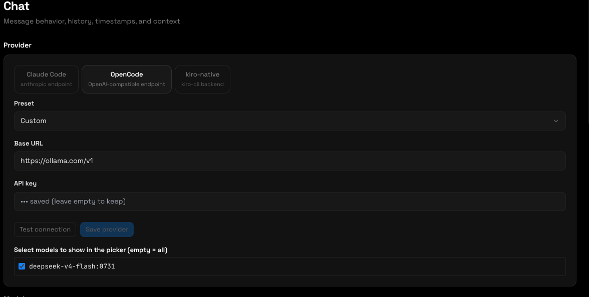
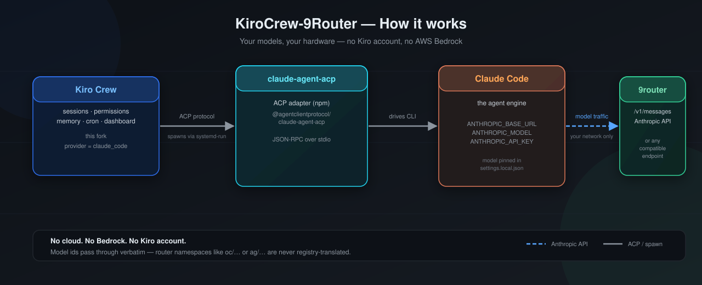
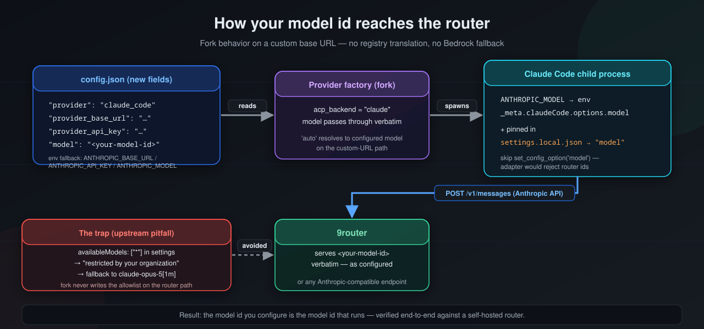
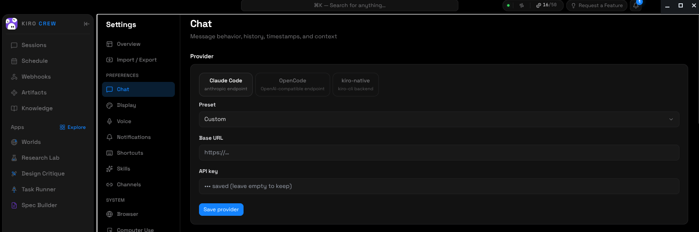

<p align="center">
  
</p>

<h1 align="center">kirocrew-customapi</h1>

<p align="center">
  <strong>kirocrew-customapi — with the Claude Code ACP backend re-enabled for self-hosted LLM routers.</strong>
</p>

<p align="center">
  This fork of <a href="https://github.com/kirodotdev/KiroCrew">kirodotdev/KiroCrew</a> re-activates the
  dormant <code>claude_code</code> provider (the <code>ACP_BACKEND_CLAUDE</code> seam) so you can drive
  kirocrew-customapi through <strong>your own model router</strong> — e.g. a local
  <a href="https://github.com/decolua/9router">9router</a> or a
  <strong>CLIProxyAPI</strong> instance at <code>http://localhost:8317</code> speaking the Anthropic API —
  instead of Kiro's built-in Bedrock catalog.
</p>

<p align="center">
  <a href="#why"><strong>Why</strong></a> ·
  <a href="#how-it-works"><strong>How it works</strong></a> ·
  <a href="#installation"><strong>Installation</strong></a> ·
  <a href="#configuration"><strong>Configuration</strong></a> ·
  <a href="#model-prefixes"><strong>Model prefixes</strong></a> ·
  <a href="#tutorial-connect-your-own-model"><strong>Tutorial: plug in your own models</strong></a> ·
  <a href="#troubleshooting"><strong>Troubleshooting</strong></a> ·
  <a href="#upstream"><strong>Upstream</strong></a>
</p>

<p align="center">
  <strong>Download the desktop app</strong> — every release ships Linux, macOS, and Windows builds.
</p>

<p align="center">
  <a href="https://github.com/encomjp/kirocrew-customapi/releases/latest">
    
  </a>
  <a href="https://github.com/encomjp/kirocrew-customapi/releases/latest">
    
  </a>
  <a href="https://github.com/encomjp/kirocrew-customapi/releases/latest">
    
  </a>
</p>

<p align="center">
  <a href="https://github.com/encomjp/kirocrew-customapi/releases/latest">
    <strong>All assets &amp; older versions →</strong>
  </a>
</p>

---

<p align="center">
  <strong>Point it at your own model router — Anthropic-compatible or OpenAI-compatible — and pick from its catalog.</strong>
</p>

<p align="center">
  
</p>

---

## Vision — image models, natively

<p align="center">
  
</p>

Every model reports whether it takes images natively. The **model picker** groups **Vision — image input** (muted **Image** pill) above **Text**, so a vision model feels native, not bolted on. The new **Settings → Chat → Vision** card governs what happens on text-only models:

- **Image input mode** — `Auto` (vision-aware) / `Native` (always pixels) / `Text` (always describe via a vision subagent)
- **On text-only models** — `Describe via vision subagent` / `Switch session to vision model` / `Off`
- **Vision fallback model** — any `cmc/`/`oc/`/`ol`/`ag`/`cx` picker id, default `cmc/mimo-v2.5`

Attach any image via the composer's `+` / drag-drop (the native `FilePreviewStrip` with numbered thumbs) — it rides as real pixels on vision models (`prompt_blocks` downscales to model limits) or as a one-shot `vision_subagent_describe` on text-only ones. The **main agent** can also call **`vision_analyze({ path|url })`** directly to describe any screenshot it just captured — the image never hits the text-only upstream.

<div align="center">

| | |
|---|---|
| **Works** | Vision picker grouping · Settings → Vision card · `vision_analyze` MCP tool · `agent.image_input_mode` / `image_redirect` / `vision_fallback_model` in `config.json` |
| **Bundled** | Fresh AppImage `0.2.0-customapi.5` (vite + PBS 397M) — no dev fallback, `supports_vision` on every `GET /api/models` row |

</div>

---

## Why

kirocrew-customapi re-enables the dormant `claude_code` provider (the
`ACP_BACKEND_CLAUDE` seam) and adds an `opencode` backend, so you can drive
Kiro Crew through **your own model router** — Anthropic-compatible or
OpenAI-compatible — instead of Kiro's built-in AWS Bedrock catalog and account.

This fork adds:

- `agent.provider` accepts **`claude_code`** and **`opencode`** in addition to the default `acp` (kiro-cli)
- new config fields **`agent.provider_base_url`** and **`agent.provider_api_key`** (+ `provider_api_format` for OpenAI-compatible wire)
- the provider factory spawns **claude-agent-acp** (Claude Code) or **opencode acp**, pointed at your base URL, with the model id passed through unchanged (router namespaces are not registry-translated)
- **Settings → Chat provider picker** — pick a backend, then a preset (Ollama Cloud, OpenCode Zen/Go, commandcode.ai, 9router, CLIProxyAPI, OpenRouter, xAI, Mistral, DeepSeek, Together, Groq, OpenAI, Anthropic), test the connection, and allowlist models
- the GUI model picker shows **prefixed model ids** (`cmc/`, `oc/`, `ol/`, `cx/`, `ag/`); the prefix is stripped before the request leaves
- `CLIPROXY_API_KEY` env var feeds the local proxy when `provider_api_key` / `ANTHROPIC_API_KEY` are unset
- **image redirect** — when a text-only model (e.g. deepseek-flash) gets an image prompt, it's routed to a vision-capable fallback model (default `cmc/mimo-v2.5`) via `agent.image_redirect` / `agent.vision_fallback_model` / `agent.text_only_models`

Everything else — desktop app, dashboard, cron, memory, skills, subagents, apps — is upstream
kirodotdev/KiroCrew.

## How it works

<p align="center">
   claude-agent-acp -> Claude Code -> CLIProxyAPI" width="900">
</p>

- **kirocrew-customapi** (this fork) acts as the harness: sessions, tool permissions, memory, cron, dashboard.
- **claude-agent-acp** is the ACP adapter (`@agentclientprotocol/claude-agent-acp` on npm) that exposes the
  Claude Code CLI as an ACP backend.
- **Claude Code** is the agent engine. It talks to your router via `ANTHROPIC_BASE_URL` /
  `ANTHROPIC_MODEL` / `ANTHROPIC_API_KEY` (the fork maps `CLIPROXY_API_KEY` into `ANTHROPIC_API_KEY`
  when no other key is set).
- **CLIProxyAPI** (or any Anthropic-compatible endpoint) serves the actual models — commandcode,
  ollama-cloud, opencode-go, codex, and antigravity behind one local proxy at `http://localhost:8317`.
  No Kiro account, no AWS Bedrock, no cloud — your traffic stays on your hardware.

## Installation

### 1. Install kirocrew-customapi from this fork

The quickest path is a source install into a virtualenv (Python 3.11+):

```bash
git clone https://github.com/encomjp/kirocrew-customapi.git
cd kirocrew-customapi
python3 -m venv .venv
.venv/bin/pip install -e .
.venv/bin/kirocrew --version
```

**Prefer the desktop app?** Grab the build for your OS with the buttons at the top of this README
(AppImage for Linux, DMG for macOS Apple Silicon, Setup.exe for Windows), or browse everything under
[the latest release](https://github.com/encomjp/kirocrew-customapi/releases/latest). Use the fork's build,
not upstream's: upstream's desktop shell is provider-agnostic, but only this fork's release is verified
against the `claude_code` router backend.

### 2. Install the Claude Code backend

```bash
# Claude Code CLI (native binary)
npm install -g @anthropic-ai/claude-code

# ACP adapter
npm install -g @agentclientprotocol/claude-agent-acp

# Make sure both are on PATH
claude --version          # e.g. 2.1.222
claude-agent-acp --help   # prints the adapter banner
```

> **Note:** some npm setups require `--allow-scripts` for the postinstall that fetches the native Claude
> binary: `npm install -g --allow-scripts=@anthropic-ai/claude-code @anthropic-ai/claude-code`

### 3. Run the doctor

```bash
.venv/bin/kirocrew doctor
```

You should see `claude-acp: ✅ ... (active backend)` once `agent.provider` is set to `claude_code`.

## Configuration

```bash
# Switch the backend from kiro-cli to Claude Code
.venv/bin/kirocrew config set agent.provider claude_code

# Point it at your router (Anthropic-compatible endpoint) — e.g. CLIProxyAPI
.venv/bin/kirocrew config set agent.provider_base_url "http://127.0.0.1:8317"

# Optional: API key for the router. If unset, ANTHROPIC_API_KEY or the
# fork-specific CLIPROXY_API_KEY from the environment is used instead.
.venv/bin/kirocrew config set agent.provider_api_key "your-key"

# Pick a model — use the PREFIXED id from the Model prefixes table
# (e.g. cmc/deepseek-v4-pro)
.venv/bin/kirocrew config set agent.model "cmc/deepseek-v4-pro"
```

Equivalent environment variables (used when the config fields are empty):

| Config field            | Environment variable    |
|-------------------------|-------------------------|
| `agent.provider_base_url` | `ANTHROPIC_BASE_URL`  |
| `agent.provider_api_key`  | `ANTHROPIC_API_KEY`   |
| `agent.model`             | `ANTHROPIC_MODEL`     |
| *(local proxy key)*       | `CLIPROXY_API_KEY` — fallback when `provider_api_key` and `ANTHROPIC_API_KEY` are unset |

The `provider_api_key` config field is stored in plaintext in `~/.kiro/crew/config.json` — prefer an
environment variable (`ANTHROPIC_API_KEY` or `CLIPROXY_API_KEY`) if your router requires a key.

## Model prefixes

CLIProxyAPI's five providers share model names — `deepseek-v4-flash` exists on both commandcode and
opencode-go, `gpt-5.6-luna` on both commandcode and codex. The router picker therefore shows
**prefixed ids** so you can tell them apart. Before the request reaches the proxy, kirocrew-customapi strips the
known prefix and sends the **raw id** — CLIProxyAPI rejects prefixed spellings (`unknown provider`).

Provider base URLs and notes:

- `cmc/` → commandcode — `https://api.commandcode.ai/provider/v1`
- `oc/` → opencode-go — `https://opencode.ai/zen/go/v1`.
  provider (kept so existing configs keep working).
- `ol/` → ollama-cloud — `https://ollama.com/v1`. Only `deepseek-v4-flash:0731` is exposed — the other
  ollama-cloud models are deliberately not in the picker.
- `cx/` → codex — models owned by OpenAI via Codex OAuth. `gpt-5.3-codex-spark` is **not** included
  (verified to 400 upstream).
- `ag/` → antigravity — three OAuth accounts, round-robin.

Rules: a known prefix is stripped and the raw id is sent upstream; an unknown or absent prefix passes
through **unchanged**; an empty alias value means "default" — no special alias is applied.

| Prefix | Provider | Picker id | Raw id sent upstream |
|---|---|---|---|
| `cmc/` | commandcode | `cmc/deepseek-v4-pro` | `deepseek/deepseek-v4-pro` |
| `cmc/` | commandcode | `cmc/deepseek-v4-flash` | `deepseek/deepseek-v4-flash` |
| `cmc/` | commandcode | `cmc/Kimi-K3` | `moonshotai/Kimi-K3` |
| `cmc/` | commandcode | `cmc/Kimi-K2.7-Code` | `moonshotai/Kimi-K2.7-Code` |
| `cmc/` | commandcode | `cmc/Kimi-K2.7-Code-Highspeed` | `moonshotai/Kimi-K2.7-Code-Highspeed` |
| `cmc/` | commandcode | `cmc/Kimi-K2.6` | `moonshotai/Kimi-K2.6` |
| `cmc/` | commandcode | `cmc/Kimi-K2.5` | `moonshotai/Kimi-K2.5` |
| `cmc/` | commandcode | `cmc/GLM-5.2` | `zai-org/GLM-5.2` |
| `cmc/` | commandcode | `cmc/GLM-5.2-Fast` | `zai-org/GLM-5.2-Fast` |
| `cmc/` | commandcode | `cmc/GLM-5.1` | `zai-org/GLM-5.1` |
| `cmc/` | commandcode | `cmc/GLM-5` | `zai-org/GLM-5` |
| `cmc/` | commandcode | `cmc/MiniMax-M3` | `MiniMaxAI/MiniMax-M3` |
| `cmc/` | commandcode | `cmc/MiniMax-M2.7` | `MiniMaxAI/MiniMax-M2.7` |
| `cmc/` | commandcode | `cmc/MiniMax-M2.5` | `MiniMaxAI/MiniMax-M2.5` |
| `cmc/` | commandcode | `cmc/mimo-v2.5-pro` | `xiaomi/mimo-v2.5-pro` |
| `cmc/` | commandcode | `cmc/mimo-v2.5` | `xiaomi/mimo-v2.5` |
| `cmc/` | commandcode | `cmc/Qwen3.8-Max` | `Qwen/Qwen3.8-Max` |
| `cmc/` | commandcode | `cmc/Qwen3.7-Max` | `Qwen/Qwen3.7-Max` |
| `cmc/` | commandcode | `cmc/Qwen3.7-Plus` | `Qwen/Qwen3.7-Plus` |
| `cmc/` | commandcode | `cmc/Qwen3.7-Flash` | `Qwen/Qwen3.7-Flash` |
| `cmc/` | commandcode | `cmc/Qwen3.6-Max-Preview` | `Qwen/Qwen3.6-Max-Preview` |
| `cmc/` | commandcode | `cmc/Qwen3.6-Plus` | `Qwen/Qwen3.6-Plus` |
| `cmc/` | commandcode | `cmc/Step-3.7-Flash` | `stepfun/Step-3.7-Flash` |
| `cmc/` | commandcode | `cmc/Step-3.5-Flash` | `stepfun/Step-3.5-Flash` |
| `cmc/` | commandcode | `cmc/hy3-paid` | `tencent/hy3-paid` |
| `cmc/` | commandcode | `cmc/gemini-3.6-flash` | `google/gemini-3.6-flash` |
| `cmc/` | commandcode | `cmc/gemini-3.5-flash` | `google/gemini-3.5-flash` |
| `cmc/` | commandcode | `cmc/gemini-3.5-flash-lite` | `google/gemini-3.5-flash-lite` |
| `cmc/` | commandcode | `cmc/gemini-3.1-flash-lite` | `google/gemini-3.1-flash-lite` |
| `cmc/` | commandcode | `cmc/fugu-ultra` | `sakana/fugu-ultra` |
| `cmc/` | commandcode | `cmc/nemotron-3-ultra-550b-a55b` | `nvidia/nemotron-3-ultra-550b-a55b` |
| `cmc/` | commandcode | `cmc/inkling` | `thinkingmachines/inkling` |
| `cmc/` | commandcode | `cmc/inkling-small` | `thinkingmachines/inkling-small` |
| `cmc/` | commandcode | `cmc/laguna-s-2.1-free` | `poolside/laguna-s-2.1-free` |
| `cmc/` | commandcode | `cmc/muse-spark-1.1` | `meta/muse-spark-1.1` |
| `cmc/` | commandcode | `cmc/muse-spark-1.2` | `meta/muse-spark-1.2` |
| `cmc/` | commandcode | `cmc/muse-spark-1.2-contributor` | `meta/muse-spark-1.2-contributor` |
| `cmc/` | commandcode | `cmc/grok-4.5` | `xai/grok-4.5` |
| `cmc/` | commandcode | `cmc/gpt-5.6-luna` | `gpt-5.6-luna` |
| `oc/` | opencode-go | `oc/deepseek-v4-flash` | `deepseek-v4-flash` |
| `oc/` | opencode-go | `oc/mimo-v2.5` | `mimo-v2.5` |
| `ol/` | ollama-cloud | `ol/deepseek-v4-flash:0731` | `deepseek-v4-flash:0731` |
| `cx/` | codex | `cx/gpt-5.6-luna` | `gpt-5.6-luna` |
| `cx/` | codex | `cx/gpt-5.6-terra` | `gpt-5.6-terra` |
| `cx/` | codex | `cx/gpt-5.6-sol` | `gpt-5.6-sol` |
| `cx/` | codex | `cx/gpt-5.5` | `gpt-5.5` |
| `cx/` | codex | `cx/gpt-5.4` | `gpt-5.4` |
| `cx/` | codex | `cx/gpt-5.4-mini` | `gpt-5.4-mini` |
| `cx/` | codex | `cx/codex-auto-review` | `codex-auto-review` |
| `ag/` | antigravity | `ag/gemini-3-flash` | `gemini-3-flash` |
| `ag/` | antigravity | `ag/gemini-3-flash-agent` | `gemini-3-flash-agent` |
| `ag/` | antigravity | `ag/gemini-3.5-flash-extra-low` | `gemini-3.5-flash-extra-low` |
| `ag/` | antigravity | `ag/gemini-3.1-pro-low` | `gemini-3.1-pro-low` |
| `ag/` | antigravity | `ag/gemini-3.6-flash-high` | `gemini-3.6-flash-high` |
| `ag/` | antigravity | `ag/gemini-pro-agent` | `gemini-pro-agent` |
| `ag/` | antigravity | `ag/gemini-3.1-flash-lite` | `gemini-3.1-flash-lite` |
| `ag/` | antigravity | `ag/gemini-3.1-flash-image` | `gemini-3.1-flash-image` |
| `ag/` | antigravity | `ag/gemini-3.5-flash-low` | `gemini-3.5-flash-low` |
| `ag/` | antigravity | `ag/claude-opus-4-6-thinking` | `claude-opus-4-6-thinking` |
| `ag/` | antigravity | `ag/claude-sonnet-4-6` | `claude-sonnet-4-6` |
| `ag/` | antigravity | `ag/gpt-oss-120b-medium` | `gpt-oss-120b-medium` |

## Tutorial: plug in your own models

This is the whole point of the fork. Any router or gateway that speaks the **Anthropic Messages API**
(`POST /v1/messages`) works — [9router](https://github.com/decolua/9router) included — with
**CLIProxyAPI** as the reference setup covered below.

### Step 1 — Run a CLIProxyAPI instance

CLIProxyAPI is a local Anthropic-compatible proxy that fronts five providers — commandcode,
ollama-cloud, opencode-go, codex (Codex OAuth), and antigravity — behind one endpoint. Run it anywhere
on your network so it listens on `http://127.0.0.1:8317`:

```bash
# see the CLIProxyAPI docs for the current install method
# (self-hosted, keeps all model traffic on your hardware)
```

After startup, verify the Anthropic endpoint answers. The proxy expects **raw** model ids here —
prefixed spellings are rejected:

```bash
curl -s -X POST "http://127.0.0.1:8317/v1/messages" \
  -H "Content-Type: application/json" \
  -H "x-api-key: $CLIPROXY_API_KEY" \
  -H "anthropic-version: 2023-06-01" \
  -d '{"model":"deepseek-v4-flash:0731","max_tokens":10,
       "messages":[{"role":"user","content":"Say hi"}]}'
```

> Any other Anthropic-compatible router works too — [9router](https://github.com/decolua/9router)
> being the classic reference setup. Only the prefixed-id catalog is CLIProxyAPI-specific.

### Step 2 — Point kirocrew-customapi at it

```bash
.venv/bin/kirocrew config set agent.provider claude_code
.venv/bin/kirocrew config set agent.provider_base_url "http://127.0.0.1:8317"
export CLIPROXY_API_KEY="your-key"   # or provider_api_key
.venv/bin/kirocrew config set agent.model "cmc/deepseek-v4-pro"
```

> Use a **prefixed** id (see the [Model prefixes](#model-prefixes) table) — the prefix is stripped
> before the request reaches the proxy, so CLIProxyAPI always receives the raw id. A raw id with no
> prefix passes through unchanged.

<p align="center">
   provider factory -> Claude Code child process -> CLIProxyAPI" width="900">
</p>

### Step 3 — Chat / run tasks

```bash
# interactive chat via the CLI
.venv/bin/kirocrew chat

# run a spec file end-to-end (decompose -> execute -> review)
.venv/bin/kirocrew run TASK.md --no-test --fresh

# or use the desktop app / dashboard as usual
```

To let `kirocrew run` execute tools without an interactive approval handler, add an auto-approve pattern:

```bash
# in ~/.kiro/crew/config.json:
# "hooks": { "auto_approve_tools": ["*"] }
```

### Step 4 — Verify it really uses your router

```bash
.venv/bin/kirocrew doctor            # claude-acp: ✅ (active backend)
# or watch the gateway log while chatting:
tail -f ~/.kiro/crew/logs/*.log      # "ACP model: <your router model id>"
```

If you see `claude-opus-5[1m]` in an error message, the model id did not reach Claude Code — see
Troubleshooting.

## Troubleshooting

### "There's an issue with the selected model (claude-opus-5[1m])"

Claude Code fell back to its built-in default model. Causes and fixes, in order:

1. **Stale `settings.local.json`** — the seed file in the workspace's `.claude/` directory is
   authoritative over env vars. Delete it (or the whole `.claude/` dir) and restart:
   ```bash
   rm -rf <workdir>/.claude
   ```
2. **`availableModels` allowlist present** — a settings file containing
   `"availableModels": ["*"]` makes Claude Code treat your router model id as "restricted by your
   organization's settings" and silently falls back to the Bedrock default. The fork only writes the
   allowlist on the Bedrock path; if you see it in a settings file, remove that key.
3. **Model id not pinned** — with a custom base URL the fork pins `"model": "<router-id>"` in
   `settings.local.json` at session spawn. If that file is missing, re-run the session.

### "Invalid value for config option model: <id>"

An old `session/set_config_option("model")` path tried to push a router id through the adapter's model
validation. The fork skips that call when `ANTHROPIC_BASE_URL` is set (the model rides via
`ANTHROPIC_MODEL` env + `settings.local.json` instead). If you still see it, your install is not the
fork — check `git log` contains the `feat: re-enable claude_code provider` commit.

### CLIProxyAPI says "unknown provider"

The proxy only accepts raw model ids; a prefixed spelling (e.g. `cmc/deepseek-v4-pro`) is rejected. Kiro
Crew strips known prefixes automatically, so this shows up only when another client sends a prefixed id
straight at the proxy. In `curl` or other tools, use the raw id from the [Model prefixes](#model-prefixes)
table.

### Router returns 429 / quota errors

That's your router's rate limit — pick a different model id or wait. The fork does not touch retry
behavior.

## Upstream

This repository is a fork of [kirodotdev/KiroCrew](https://github.com/kirodotdev/KiroCrew) (Apache 2.0).
Fork changes live on `main` (with `testing` for pre-release work), rebased onto
upstream `kirodotdev/KiroCrew` `main`. Rebase conflicts stay small as long as
the dormant seam (comments referencing `ACP_BACKEND_CLAUDE`) is preserved.

- Upstream: https://github.com/kirodotdev/KiroCrew
- License: [Apache 2.0](LICENSE)

## Provider settings

Point the app at your own router — Claude Code (Anthropic endpoint) or
OpenCode (OpenAI-compatible endpoint), with presets for the popular gateways
(Ollama Cloud, OpenCode Zen/Go, commandcode.ai, 9router, CLIProxyAPI, OpenRouter,
xAI, Mistral, DeepSeek, Together, Groq, OpenAI …), a connection test, and a
model allowlist so the picker only shows the models you actually use.



Model selection — pick a backend, then choose your provider and model from the
catalog your router exposes:


## Updating from the fork

This fork updates from **its own repo** (`encomjp/kirocrew-customapi`), never
from upstream `kirodotdev/KiroCrew`.

- **Desktop app:** updates come from this repo's GitHub Releases (single
  `stable` lane). The release workflow attaches `latest-mac.yml` /
  `latest-linux.yml` automatically.
- **Gateway (git install):** the update check, the dashboard Update button,
  and the boot auto-update all follow whatever remote the current branch
  tracks. In this repo `origin` is the fork itself, so `main` tracks
  `origin/main` by default — verify once:

  ```bash
  git branch --set-upstream-to=origin/main main
  ```

  Boot auto-update runs **only on branch `main`** (`git reset --hard
  <remote>/main`), so keep feature/`testing` branches off `main` if you don't
  want them reset.

- Every release must bump `__version__` in `src/kiro_crew/__init__.py`, or the
  version comparison won't detect the update.
