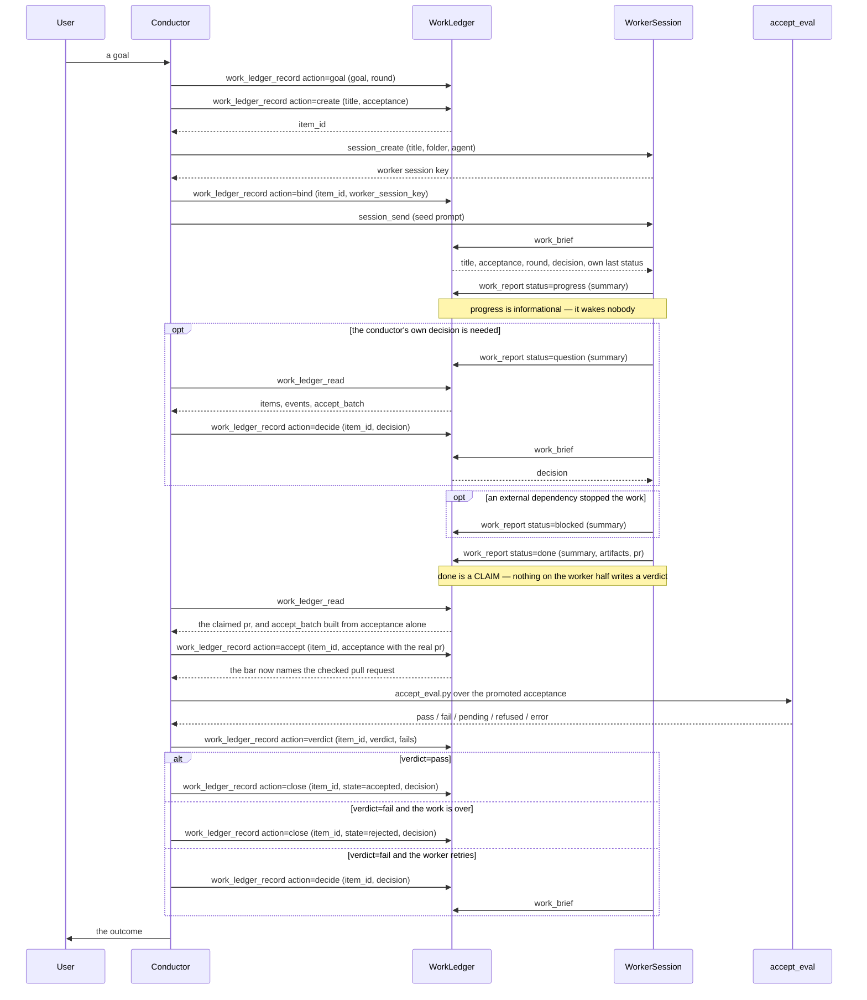

# Ledger-conductor dispatch sequence

**Local page, not a mirror.** This file is Kiro Crew's own documentation and has no upstream source, so a re-fetch of the `kiro-cli/` mirror must leave it alone. It is marked as a named exception in [the Reference index](README.md).

This page traces one work item from the moment a conductor mints it to the moment it is closed, end to end. It extends the shorter "Binding lifecycle" diagram in [the work-ledger RFC](../request-for-change/rfc-conductor-work-ledger.md) past the first report, through acceptance promotion, evaluation, and the terminal write. Every action name and every status value below is taken from the tool surface in `src/kiro_crew/mcp_work.py` and the routes in `src/kiro_crew/dashboard/handlers/work_ledger.py`.

The two halves of the surface never overlap. A conductor writes with `work_ledger_record` and reads with `work_ledger_read`; a worker reads with `work_brief` and writes with `work_report`. Which half answers a call is resolved from the caller's own session identity, so a worker has no parameter naming its item, its conductor, or itself.

## Sequence

## Legend

`work_ledger_record` takes exactly one `action` per call, and the seven are `goal`, `create`, `bind`, `decide`, `accept`, `verdict`, and `close`.

`work_report` takes exactly one `status`, and the four are `progress`, `blocked`, `question`, and `done`. `blocked` and `question` differ by who must act: `blocked` names an external dependency, `question` needs the conductor's own decision.

**`done` is a claim.** A worker calling `work_report status=done` says it believes the acceptance condition is met and puts its evidence in `artifacts` and `pr`. It has no parameter that writes a verdict, a state, or an acceptance condition.

**`verdict` is the evaluator's answer.** It carries `accept_eval.py`'s own five values — `pass`, `fail`, `pending`, `refused`, `error` — recorded under the conductor's key after the script ran. A claim and a verdict are therefore two different facts about the same item, and both are stored.

**`accept` is why a `pr` claim is not self-serving.** `accept_batch` is composed from each item's stored `acceptance` alone and deliberately ignores whatever `pr` a worker reported, so a worker cannot point the bar at someone else's green pull request. Promoting the number into the bar is a separate conductor write, made after the conductor has read and checked it, and it refuses to clear the bar rather than accepting an empty condition.

**`verdict` and `state` answer different questions.** `verdict` is the evaluator's reading; `state` is the conductor's disposition, written by `close` as `accepted`, `rejected`, or `abandoned`. An item can hold `verdict: fail` and stay open while the worker retries.

**The bind precedes the seed.** A worker that runs before its binding exists reads `not_bound` and cannot retry intelligently, so `action=bind` is sent before `session_send`. A bound item with no session is visible and recoverable; an unbound running worker is neither.

**Every write appends exactly one event.** There is no way to change a field without also appending a line to the item's event log, which is what lets a conductor read history rather than infer it from a transcript.
