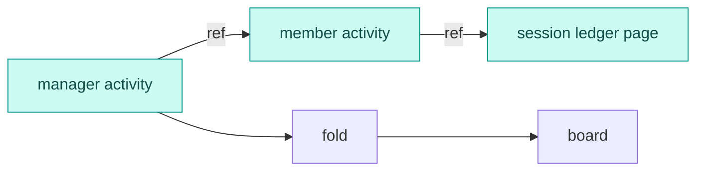

# RFC: Append-only ledger — one record per unit, every view a fold

Status: in-progress. The storage below, and the first emitter that writes to it, land
together in [#10091](https://github.com/kirodotdev/KiroCrew/pull/10091). Nothing is on
main yet: there `members.py` writes pointer entries with no `type` and no `seq`, and
`work_ledger.py` and `session_ledger.py` each keep their own head. This is the storage
under *Crew Mode: Agent-to-Agent Session Collaboration* §8, a companion design outside
this tree whose sections are cited below as "Crew Mode §N"; scope is Kiro Crew's public
tree.

## 1. Introduction: five heads, no history

Five stores write the same kind of fact today: the members' JSON files, the crew store's
JSON files, the work ledger, the session ledger, and a lifecycle event schema with no
writer. Each is a head with no history, and heads disagree. This design rewrites the
crew's activity record as its one append-only ledger and makes every other view a fold
over it.

Two units. A **crew** has an activity ledger; a **session** has a ledger. A crew's entry
is a sentence plus a **pointer** into a session's: "I opened PR-4127" and where to read
it. The security event log stays as the global audit log beside both. Vocabulary follows
the code (`session_ledger.py`, `work_ledger.py`): a **ledger** is the append-only file, a
**projection** a head folded from it — the word the dashboard frames use.

## 2. Requirements

- FR-1 One file per unit; the gateway is the only writer; `seq` is contiguous.
- FR-2 A line is never rewritten; a correction is a new line.
- FR-3 Every type belongs to one unit; a guest writes only in its namespace
  (`crew:<name>/…`) — a secretary in its conductor's ledger under the same rule as
  `crew:<child>/report`.
- FR-4 Any line may carry `ref`, resolved at read time page by page; no fold reads more
  than its own ledger.
- FR-5 A projection folds one ledger and carries its `seq` as version; a reconnect
  truncates.
- FR-6 A phase change without a reason is a defect (Crew Mode §7).
- FR-7 Safe to surface: no secrets, transcript bodies, machine paths or host names in
  public fields; a `ref` instead.
- FR-8 Cold load synthesizes closers for open intervals.
- NFR-1 Cheap to fold: checkpoints on disk; state never replays everything.
- NFR-2 The backend extracts, the frontend loads pages; no client folds a ledger.

## 3. Files and envelope

```
<data home>/ledgers/crews/<crew>/ledger.jsonl               the crew's activity ledger
<data home>/ledgers/crews/<crew>/projections/<key>.json     fold checkpoints, disposable
<data home>/ledgers/sessions/<id>/ledger.jsonl              the session ledger
```

Line 1 is the header; then:

```json
{"type": "crew:qa/report", "seq": 388, "time": 1789000000000, "src": "crew:qa",
 "thread": 120, "ref": {"unit": "session", "id": "s-7f3a", "from": 40, "to": 96},
 "data": {...}}
```

There is one event system, not two. The entry is field-compatible with
`kiro_crew.events`: `type` is that envelope's `kind`, `time` is its `ts_ms`, and the unit
id in the path plays its `key` — same `domain/action` naming, same epoch-millisecond
clock, so one projection can fold both streams on one axis. This is therefore the stream a
future emitter writes when it needs order, threading or citation, and `seq` is what it
adds: per unit, one contiguous sequence inside one file, assigned by that file's single
writer.

`type` is `domain/action`; `seq` and `time` are assigned at append; `src` names the emitter
(`gateway`, `acp`, `dashboard`, `patrol`, `session:<id>`, `crew:<name>`, `app:<name>`);
`data` is the fact, and a serialized entry is capped at 64 KiB. `thread` groups: it is the
`seq` of an earlier entry in the same file, the message that started the work, like a chat
thread id. `ref` is a permalink into a ledger segment, `{unit, id, from, to}`.

The header keeps its own spelling, because it describes the file rather than something
that happened. A crew ledger opens with `{type: crew, version, id, createdAt}` and nothing
more: a crew's name and template belong to the members store, which can change them, and
an append-only line cannot. A session ledger adds `owner`, `agent` and the optional
`task`, `pack`, `slot`, `thread: {crew, seq}`, `cwd` and `remote`. `owner` never changes.

## 4. Event families

Crew activity ledger:

| family | types | pointer |
|---|---|---|
| shipped | `member/*`, `activity/record`, `slot/*`, `patrol/*` | `slot/*` → the session |
| messages | `message/received`, `message/sent` | body → the transcript store |
| tree | `crew/child-attached`, `crew/parent-attached`, `*-detached` | — |
| signed | `crew:<parent>/dispatch`, `crew:<child>/report` | report → the child's segment |
| topics | `crew/topic-*`, `crew/forwarded`, `crew/run-state` | topic → its work session |
| items | `item/phase {from,to,reason}`, `item/next`, `item/probe`, `item/verdict`, `crew/round-*` | probe, verdict → evidence |
| knowledge | `crew/finding`, `crew/summary`, `crew/note-*`, `crew/link` | the segment covered |
| memory | `memory/bound\|copied\|forgotten\|restored` | — |

Messages are entries, so the chat surface is a fold: the direct message is the entries
with no `thread`; a thread page is those whose `thread` is that anchor; a permalink reply
is a `message/sent` whose `ref` points at the anchor; and "also sent to the direct
message" is a summary with no `thread` whose `ref` points at the thread.

Session ledger: `session/opened|closed`, `turn/started|completed {usage, credits}`,
`step/*`, `tool/*`, `approval/requested|decided`, `model/selected`, `compaction/applied`,
`remote/placed|lost`. Bodies stay in the transcript store; the ledger indexes them by
`ref`.

## 5. Projections and pages

Every projection folds one ledger:

| projection | ledger | value |
|---|---|---|
| `roster`, `activity`, `wake`, `driving` | crew | as today; `activity` served in pages |
| `tree`, `topics`, `items`, `board`, `budget`, `attention` | crew | children; work trees; item heads; latest report per child; credits from reports; items blocked or overdue |
| `context` | crew | what a session is given each turn: findings, summaries, notes, links, latest reports |
| `status`, `usage`, `timeline`, `tools`, `approvals` | session | the session side panel |

`board` and `budget` need no child ledger: a report carries status and credits; its `ref`
is the drill-down. Reading a team is paging: a report's `ref` loads a page of the child's
activity, whose `ref`s load pages of session ledgers.



The dashboard splits the same way: the backend folds and cuts pages
(`/crews/<id>/activity?before=<seq>&limit=`, `/sessions/<id>/ledger?from=&to=`) and pushes
`member_projection` and `session_projection` frames; the frontend renders and pages, never
folds.

## 6. Grants and visibility

Resolution has two outcomes, `ok` and `gone` — a purged target is `gone`. There is no
`forbidden` yet, because this layer has no permission model to deny with and a check with
nothing behind it only looks like a boundary. It arrives with the first caller that has
one, and the grants with it: an attach lets the parent resolve into the child's ledger, a
dispatch into the dispatched session. Each type carries a visibility class (`public`,
`tree`, `owner`); a filtered line leaves a tombstone so `seq` stays contiguous.
`member/binding`, `member/rules` and `turn/started` are `owner`. Below all of that,
`ledgers/` carries the same sandbox deny as the work ledger — only the gateway process
reads or writes it — so in-sandbox code can neither forge an entry attributed to the
gateway nor rewrite the history a conductor is meant to trust.

## 7. Migration

Activity ledger: `members/<slug>/activity.jsonl` is rewritten into the envelope at
`ledgers/crews/<crew>/ledger.jsonl`, with `seq` assigned in file order. Crew store: fold
its JSON files into `topics` lines once, rename them `.migrated`, route `CrewStore` through
the ledger. Work ledger: `items/<id>.jsonl` lines become `item/*` events,
`items/<id>.json` the `items` checkpoint; the `work_*` tools keep their surface. Sessions:
a ledger from `session/opened`.

## 8. Delivery

**PR 1** ([#10091](https://github.com/kirodotdev/KiroCrew/pull/10091)) is the whole storage
layer, for both kinds: the files, the envelope with `src`, `thread` and `ref`, the headers,
type ownership, guest namespaces, `get` and `iter_from`, page by `seq`, page by `thread`,
`resolve` with `ok` and `gone`, torn-tail repair that closes an open interval on open with a
deterministic closer — an interrupted turn gets `turn/completed {stop_reason: interrupted}`
stamped at the last real entry's time, so two readers of the same bytes agree — and the
OS-masked `ledgers/` leaf. Its first writer ships with it: the session emitter behind
`KIROCREW_SESSION_LEDGER=1`, default off. A session-kind entry carries its turn identity in
`data.turn` (and `data.step`), known at emit time, and leaves `thread` unset.

**PR 2** is projections and checkpoints, the dashboard paging endpoints and frames, the
direct-message and thread UI, the crew writer that rewrites the activity ledger, migration
of the crew store's JSON files and of the work ledger, and the secretaries.

## 9. Open questions

1. Page size and checkpoint cadence.
2. Session ledger retention; a crew ledger is never deleted, its pointers may resolve to
   `gone`.
3. An `ignorable` marker so a reader refuses to reconstruct on an unknown required type.
4. App and cron kinds: same envelope, emitters not landed.
